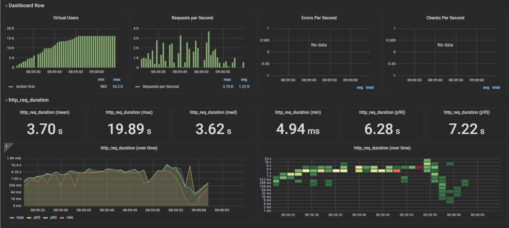
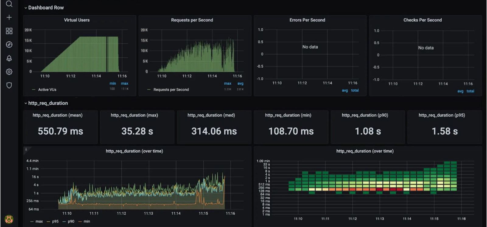

# Aprimoramento dos Testes 
Este relatório compara dois testes de carga realizados utilizando K6 e Grafana, ambos executados sob o mesmo cenário e infraestrutura, com o intuito de avaliar o aprimoramento do desempenho do sistema. O teste novo é uma versão aprimorada do segundo teste, ambos realizados na AWS EC2, mas com a inclusão de um Load Balancer no teste mais recente. O objetivo é analisar como essa melhoria impactou a escalabilidade, tempos de resposta e a robustez da aplicação.

## Cenário de Teste 
O principal requisito dos testes foi simular uma situação de pico de tráfego, onde o sistema teria que lidar com 35 mil requisições por segundo. O código de configuração dos testes foi definido da seguinte forma:
```
export const options = {
  scenarios: {
    constant_request_rate: {
      executor: 'constant-arrival-rate',
      rate: 35000, // 35 mil requisições por segundo
      timeUnit: '1s', 
      duration: '5s',
      preAllocatedVUs: 100,
      maxVUs: 35000,
    },
  },
},

```
Este cenário foi desenhado para simular um tráfego extremamente elevado, com a intenção de observar como o sistema reage sob condições de alta carga, especialmente em datas de grande demanda, como a Black Friday, quando sistemas de e-commerce e serviços online enfrentam grandes picos de acessos simultâneos.


## Teste Antigo :
- Virtual Users (VUs): 16.3K no pico.
- Requests per Second (RPS): 1.22K RPS (média) com um pico de 3.70K.
- HTTP Request Duration (Média): 3.70 s.
- HTTP Request Duration (Máximo): 19.89 s.
- HTTP Request Duration (Mediana): 3.62 s.
- HTTP Request Duration (Mínimo): 4.94 ms.
- HTTP Request Duration (p90/p95): 6.28 s / 7.22 s.

<div align="center">
<sub>Figura 1 - grafana</sub>

<sup>Fonte: Material produzido pelos autores (2024)</sup>


Este teste, sem a utilização de um Load Balancer, foi capaz de simular uma carga considerável de 16.2K usuários virtuais.
O tempo de resposta médio de 3.70 segundos mostrou que o sistema teve dificuldades para responder com eficiência, especialmente sob picos de tráfego elevados.
Os tempos de resposta máximos, que chegaram a 19.89 segundos, indicam que o sistema não conseguiu processar de forma otimizada as requisições em momentos de maior sobrecarga.

## Teste Novo 
- Virtual Users (VUs): 17.1K no pico.
- Requests per Second (RPS): 2.01K RPS.
- HTTP Request Duration (Média): 550.79 ms.
- HTTP Request Duration (Máximo): 35.28 s.
- HTTP Request Duration (Mediana): 314.06 ms.
- HTTP Request Duration (Mínimo): 108.70 ms.
- HTTP Request Duration (p90/p95): 1.08 s / 1.58 s.

<div align="center">
<sub>Figura 2 - grafana</sub>

<sup>Fonte: Material produzido pelos autores (2024)</sup>

O novo teste foi projetado para melhorar o desempenho geral, agora utilizando um Load Balancer da AWS. Isso permitiu distribuir a carga entre duas instâncias EC2, resultando em uma taxa de requisições por segundo mais alta, com 2.01K RPS.
A performance melhorou significativamente, com o tempo de resposta médio reduzido para 550.79 ms, o que indica que o sistema reagiu de forma muito mais eficiente à sobrecarga simulada.
O tempo de resposta máximo de 35.28 segundos indica que ainda existem casos extremos onde o sistema enfrenta dificuldades em cenários de carga muito elevada, mas o balanceamento de carga garantiu que a maioria das requisições fossem processadas de forma rápida.


A inclusão do Load Balancer da AWS foi essencial para o sucesso do teste mais recente. Comparado ao segundo teste, o teste novo apresentou tempos de resposta muito mais rápidos e uma distribuição de carga mais eficiente. O tempo de resposta médio caiu de 3.70 segundos para 550.79 ms, com uma melhoria significativa nos percentis p90 e p95, reduzindo os tempos de resposta para a maior parte das requisições.
