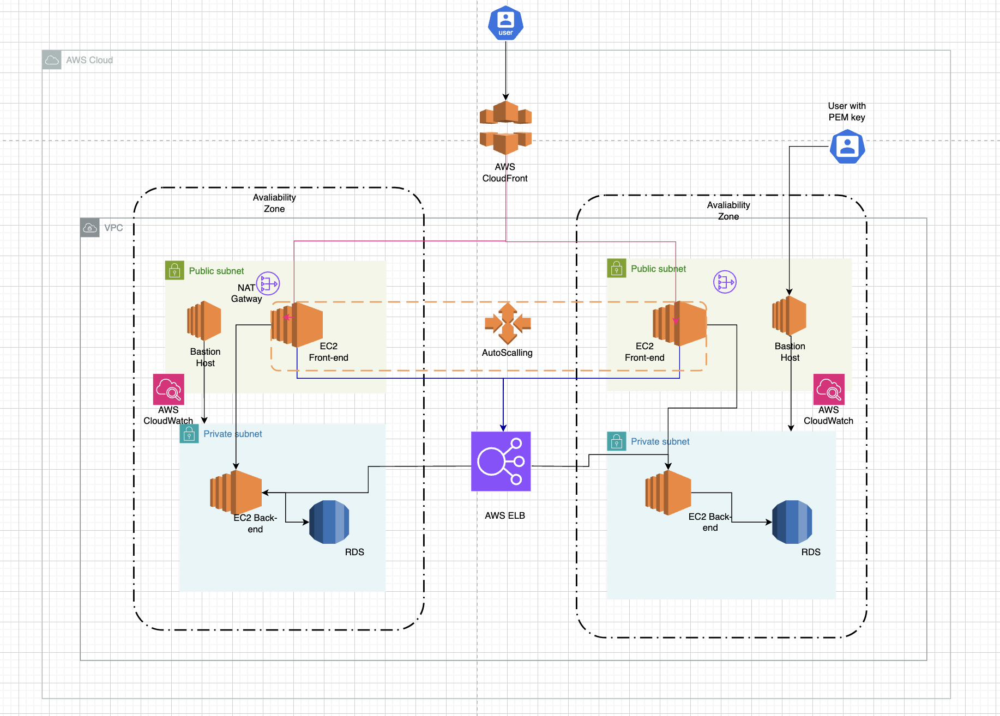

# Arquitetura Corporativa 

Figura 1 - Arquitetura corporativa

Fonte: Material produzido pelos autores (2024)

## Principais componentes e suas funcionalidades no projeto

**Virtual Private Cloud (VPC):** A VPC é uma rede virtual onde os recursos da AWS são implantados em uma zona isolada e pré-configurada, semelhante a uma rede tradicional que você operaria no seu próprio data center, mas com a vantagem dos serviços e infraestrutura da AWS. A VPC pode ser configurada como pública ou privada, conforme as necessidades de acesso dos serviços nela implementados. A seguir, estão descritas as VPCs configuradas como parte da solução.

**Zonas de Disponibilidade (AZs):** A arquitetura proposta está distribuída entre múltiplas Zonas de Disponibilidade (AZs) dentro de uma Região da AWS. As AZs são localizações físicas distintas, cada uma com uma infraestrutura independente, garantindo que uma falha em uma AZ não afete as outras.

**Bastion Hosts:** Servem como pontos de acesso seguros para instâncias localizadas em sub-redes privadas e públicas dentro da VPC. Esses hosts permitem ao Gerente de Tecnologia da Informação realizar modificações diretas no código-fonte, no banco de dados ou em configurações de serviços associados às máquinas hospedadas. Eles estão posicionados em uma camada de rede pública da AWS para facilitar o acesso via internet, sendo essenciais para garantir a acessibilidade global aos serviços críticos.

**Nat Gateway**:  O NAT Gateway conecta às sub-redes privadas via tabela de rotas, e a finalidade dessa conexão é permitir que as sub-redes privadas tenham acesso a internet para baixar atualizações, etc., mas sem permitir que a internet tenha acesso a elas. Ela concentra as requisições de todas as instâncias da sub-rede sob um único IP público.

**Amazon Elastic Compute Cloud (Amazon EC2):** oferece capacidade de computação escalável sob demanda na nuvem AWS. O uso do EC2 reduz a necessidade de investimentos em hardware físico, permitindo o desenvolvimento e a implantação de aplicativos de forma mais rápida e eficiente. Neste projeto, o backend da aplicação é executado no EC2, com um IP de acesso privado, assegurando maior proteção contra acessos não autorizados via internet.

**Amazon Relational Database Service (Amazon RDS):** fornece uma solução gerenciada para configurar, operar e escalar bancos de dados na nuvem. Neste contexto, o RDS é implantado em uma rede privada, acessível apenas pelos responsáveis por operações críticas de modificação, aumentando a segurança e confiabilidade da aplicação.

**Application Load Balancer (ALB):**  ALB opera no nível de solicitação, distribuindo o tráfego para instâncias EC2, contêineres, endereços IP ou funções Lambda, com base no conteúdo das requisições. É ideal para cenários que demandam roteamento avançado de tráfego HTTP/HTTPS, suportando arquiteturas modernas como microsserviços e aplicações baseadas em contêineres. No projeto, o ALB está implementado em uma VPC customizada, garantindo que o tráfego interno seja gerenciado de forma segura, sem exposição direta à internet.

**CloudFront:** é um serviço que acelera a distribuição de conteúdo web, tanto estático quanto dinâmico, incluindo arquivos como .html, .css, .js, e imagens. O serviço usa uma rede global de pontos de presença (localizações de borda) para garantir que o conteúdo seja entregue aos usuários com a menor latência possível, melhorando significativamente o desempenho da aplicação.

**Auto Scaling:** ajusta automaticamente o número de instâncias de EC2 com base nas condições de carga do sistema, como o uso da CPU. Isso garante que a infraestrutura possa se adaptar dinamicamente às mudanças na demanda, assegurando que o sistema tenha a capacidade necessária para lidar com a carga em cada momento, sem excesso de provisionamento.

**Amazon CloudWatch:** é um serviço de monitoramento que coleta e rastreia métricas, gera logs e cria alarmes. No projeto, o CloudWatch é essencial para monitorar o desempenho das instâncias EC2, ALB, e outros recursos, fornecendo insights em tempo real sobre a saúde do sistema. Ele também permite a criação de alertas e dashboards para garantir que problemas sejam identificados e resolvidos rapidamente. 

## Requisitos

&emsp; A seguir, será apresentado como a arquitetura da solução atende aos requisitos do projeto, permitindo compreender melhor como os serviços da aplicação se relacionam com essas demandas específicas.

- **Balanceamento de carga:** Para esse requisito, usamos o Amazon Load Balance para distribuir a carga de tráfego entre as instâncias EC2 . O ALB assegura que as requisições dos usuários sejam distribuídas de forma equilibrada entre as instâncias, garantindo a disponibilidade e a eficiência do serviço. Esse balanceamento permite que, mesmo em caso de aumento repentino na demanda, o tráfego seja gerido de forma a evitar sobrecarga em uma única instância, assegurando uma experiência consistente e de alta qualidade para os usuários finais.

- **Elasticidade:** A elasticidade é garantida pelo Auto Scaling, que ajusta automaticamente a quantidade de instâncias EC2 de acordo com a demanda, tanto no Front-end quanto no Back-end. Isso permite que o sistema cresça ou encolha conforme necessário, assegurando que os recursos estão sendo usados de forma eficiente.

- **Desempenho:** O desempenho da aplicação será monitorado por meio de Amazon CloudWatch, que rastreia métricas importantes e permite a configuração de alarmes. Além disso, ferramentas como K6 e Grafana serão utilizadas para simulações de tráfego e testes de carga, permitindo avaliar a latência e a capacidade de resposta da aplicação em diferentes condições.

- **Capacidade de Failover:** O RDS é configurado com replicação Multi-AZ, garantindo alta disponibilidade e failover automático em caso de falhas. As instâncias EC2 estão distribuídas entre múltiplas AZs, garantindo que, se uma zona falhar, o serviço continue funcionando a partir de outra AZ.

- **Tolerância a falhas:** É indispensável garantir que o banco de dados RDS esteja configurado com backups e que as instâncias EC2 e o RDS operem em múltiplas zonas de disponibilidade, de modo que uma falha em uma zona não interrompa o funcionamento da aplicação.

- **Escalabilidade:** A escalabilidade é alcançada ajustando os recursos das instâncias EC2 e configurando o Auto Scaling para lidar com picos de alta demanda. Também é importante verificar se o Load Balancer (ALB) está configurado para distribuir eficientemente a carga entre as instâncias EC2.

- **Distribuição de cargas:** O Amazon CloudFront auxilia na distribuição da carga e na redução da latência para o cliente final, melhorando a qualidade da experiência do usuário na plataforma.

&emsp; Portanto, a arquitetura proposta aborda de maneira abrangente os requisitos essenciais para garantir o bom funcionamento da aplicação, como balanceamento de carga, escalabilidade, elasticidade, tolerância a falhas, entre outros. A utilização de serviços da AWS, tais como instâncias EC2, RDS, Auto Scaling e Amazon CloudFront, permite não apenas uma distribuição eficiente de recursos, mas também uma resposta rápida a picos de demanda, assegurando uma experiência estável e de qualidade para os usuários finais.
