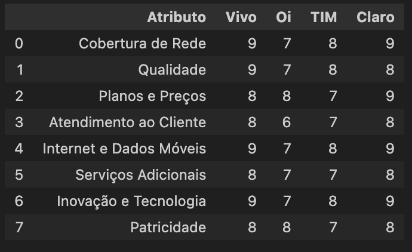
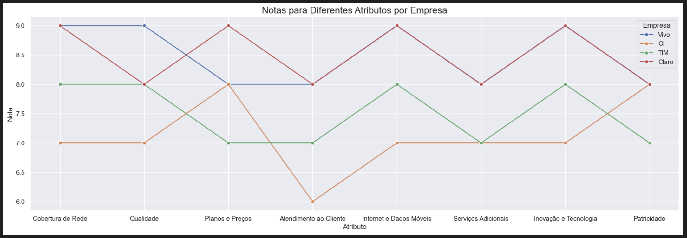
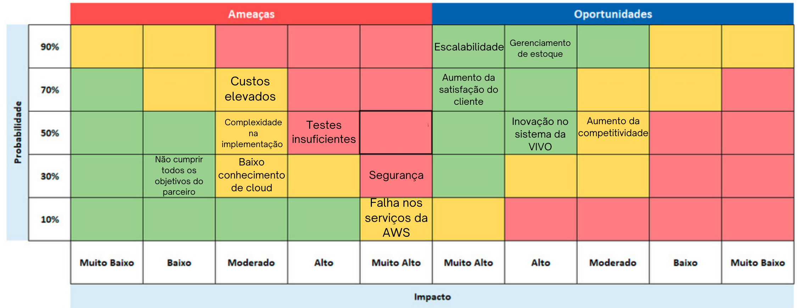
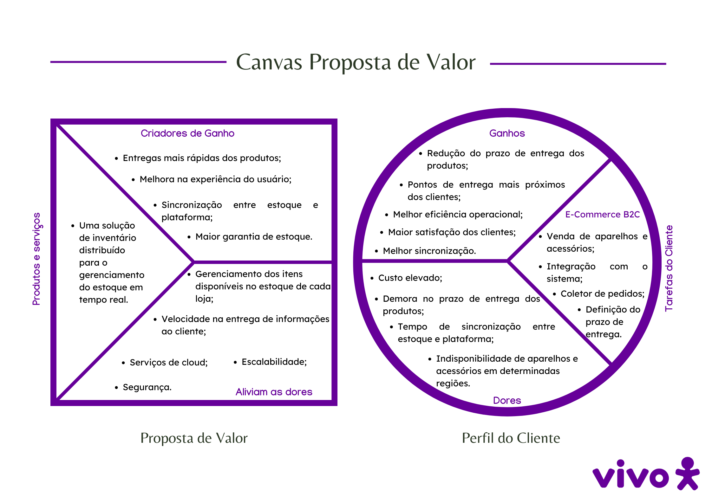

# Entendimento de negócios 

## Análise Financeira

&emsp;&emsp;A análise financeira de um projeto é uma avaliação detalhada dos aspectos monetários relacionados a ele. Envolve a análise dos investimentos necessários, dos custos esperados e das receitas projetadas ao longo de um determinado período, geralmente um ano. Esta análise é crucial para entender a viabilidade financeira do projeto e tomar decisões informadas sobre sua implementação.

&emsp;&emsp;O primeiro passo na análise financeira é determinar o montante de investimento necessário para iniciar e manter o projeto. Isso inclui custos como aquisição de equipamentos, contratação de pessoal, despesas operacionais, entre outros. Conhecer esses valores é fundamental para planejar adequadamente o financiamento do projeto.

&emsp;&emsp;Em seguida, é importante projetar os custos operacionais esperados ao longo do período em análise. Isso inclui despesas recorrentes como salários, aluguel, matéria-prima, marketing, entre outros. A compreensão desses custos permite estimar o ponto de equilíbrio do projeto e determinar se ele será capaz de gerar lucro.

&emsp;&emsp;Além dos custos, a análise financeira também examina as projeções de receitas relacionadas ao projeto. Isso envolve estimar as vendas esperadas, considerando fatores como demanda de mercado, preços de venda, sazonalidade, entre outros. A receita projetada é essencial para calcular o potencial de retorno sobre o investimento e avaliar a lucratividade do projeto.

&emsp;&emsp;Em resumo, a análise financeira do projeto fornece uma visão abrangente dos aspectos monetários envolvidos, desde os investimentos iniciais até as receitas esperadas. Sua importância reside em fornecer informações críticas para a tomada de decisão, ajudando os parceiros a avaliar o risco e a rentabilidade do projeto antes de sua implementação.

### Projeções de Custo

&emsp;&emsp;As projeções de custo são estimativas ou previsões dos gastos que uma empresa ou projeto pode incorrer ao longo de um período específico. Essas projeções abrangem diversas áreas, como custos operacionais, de produção, de pessoal, de marketing e administrativos. Baseadas em análises detalhadas das despesas passadas e considerações sobre mudanças futuras no ambiente econômico e de mercado, essas projeções são fundamentais para o planejamento financeiro, a definição de metas realistas e a tomada de decisões estratégicas.

1. Custos de Mão-de-Obra
- Hora de trabalho de cada desenvolvedor: R$ 80
- Horas de trabalho por dia: 5 horas
- Dias de trabalho por semana: 5 dias
- Número de semanas: 10 semanas
- Número de desenvolvedores: 5 membros 
- $$\text{Custo} = \text{Horas} \times \text{Preço por hora} \times \text{Dias de Trabalho (Semana)} \times \text{Número de Semanas} \times \text{Número de Desenvolvedores}$$

E aplicando essa equação dentro do nosso projeto fica: 

$$\text{Custo} = 5 \times 80 \times 5 \times 10 \times 5 = R\$100.000,00\$$$

Levando em conta que o custo de mão de obra seria apenas da implementação durante as 10 semanas de projeto. 

2.Custos e serviços AWS

&emsp;Para calcular os custos dos serviços da AWS, consideramos dois dos serviços que irão ser utilizados no projeto: Amazon EC2 (Elastic Compute Cloud) e Amazon RDS (Relational Database Service). A estimativa será baseada em um uso moderado desses serviços ao longo do período do projeto.

 2.1. Amazon EC2
- Tipo de Instância: t3.medium
- Custo por hora: R$ 0,20
- Horas de uso por dia: 24 horas
- Dias de uso por mês: 30 dias
 - Número de instâncias: 3

$$\text{Custo EC2} = \text{Custo por Horas} \times \text{Horas por uso} \times \text{Dias de uso} \times \text{Número de instâncias} \times \text{Número de meses}$$

$$\text{Custo} = 0,20 \times 24 \times 30 \times 3 \times 2,5 = R\$1.080,00\$$$

2.2. Amazon RDS
- Tipo de Instância: t3.medium
- Custo por hora: R$ 0,25
- Horas de uso por dia: 24 horas
 - Dias de uso por mês: 30 dias
 - Número de instâncias: 2

$$\text{Custo EC2} = \text{Custo por Horas} \times \text{Horas por uso} \times \text{Dias de uso} \times \text{Número de instâncias} \times \text{Número de meses}$$

$$\text{Custo} = 0,25 \times 24 \times 30 \times 2 \times 2,5 = R\$900,00\$$$

3.Cálculo total de custos do projeto
$$\text{Custo total} = \text{Custo de mão de obra} \times \text{Custos EC2} \times \text{Custos RDS} $$

$$\text{Custo total} = \text{100.000,00} \times \text{1.080,00} \times \text{900,00}= R\$101.980,00$$

A partir desses cálculos podemos cálcular os custos totais por ano que seriam:

$$\text{Custos anuais} = \text{Custo mão de obra} + \text{Custos EC2 anual } + \text{Custo RDS}$$

$$\text{Custos anuais} = \text{100.000,00} + \text{5.184,00} + \text{4.320,00} = R\$ 109.504,00$$

## Projeções de receitas 
 &emsp;&emsp;As projeções de receita são estimativas das entradas de dinheiro que uma empresa ou projeto pode receber ao longo de um período específico. Com base no histórico de vendas, nas tendências de mercado e nas estratégias de marketing, essas projeções oferecem uma visão clara do potencial de receita e auxiliam na elaboração de orçamentos e na definição de metas de vendas. Essa análise é essencial para o planejamento financeiro e o desenvolvimento de estratégias de crescimento.

&emsp;&emsp;Ao implementar o sistema de inventário distribuído, espera-se um aumento significativo nas vendas devido a uma melhor disponibilidade dos produtos, redução de capital imobilizado em estoque excessivo e maior satisfação dos clientes. Além disso, o projeto também deve reduzir os custos operacionais da plataforma de e-commerce, uma vez que diminui a necessidade de processamento intensivo para validação do estoque.

&emsp;&emsp;No momento, não dispomos de dados específicos como a receita anual atual ou as expectativas quantitativas de crescimento, porém o cálculo seria feito:

1. Crescimento anual esperado
    - $$\text{Crescimento esperado das vendas} = \text{Receita atual} \times \text{Percentual de crescimento}  $$ 

2. Receita anual projetada
    - $$\text{Receita anual projetada} = \text{Receita anual atual} \times \text{Crescimento esperado das vendas do ano }  $$ 

&emsp;&emsp;No entanto, com base em uma análise qualitativa, podemos destacar os seguintes pontos que indicam um potencial aumento nas receitas com a implementação do projeto:
- Economia de Custos Operacionais:Embora os números exatos não estejam disponíveis, a redução dos custos operacionais, como os relacionados à manutenção do estoque e ao processamento de dados, contribui indiretamente para a melhoria da margem de lucro.

- Melhoria na Disponibilidade de Produtos: A solução de inventário distribuído visa garantir que os produtos estejam mais frequentemente em estoque, o que evitaria rupturas e possíveis perdas de vendas.

- Redução do Tempo de Processamento: Ao reduzir o tempo necessário para validar o estoque, a eficiência do e-commerce aumenta, permitindo uma melhor experiência do usuário e, consequentemente, uma potencial elevação na taxa de conversão de visitantes em clientes.

- Maior Satisfação do Cliente: Com um sistema mais eficiente e uma melhor gestão do estoque, os clientes terão uma experiência de compra mais positiva, o que pode resultar em um aumento na fidelização e no valor médio de pedidos.

## Matriz Oceano Azul

&emsp;O framework "Oceano Azul" foi desenvolvido por W. Chan Kim e pela Renée Mauborgne em 2005 com a missão de oferecer uma abordagem estratégica inovadora às empresas, incentivando a exploração de novos mercados(oceano azul), onde a competição é quase inexistente, as regras ainda não foram definidas, e existe uma rica possibilidade de crescimento e lucro, ao invés de batalhar em mercados saturados, os "oceanos vermelhos", onde as regras são amplamente conhecidas e existe muita competição.

&emsp;Nessa estratégia são usadas quatro ações: Reduzir, Eliminar, Aumentar e Criar. Essas ações visam diferenciar as empresas e produtos, permitindo que se destaquem em ambientes de mercado não convencionais e inexplorados.

### Reduzir
&emsp;Essa ação tem o objetivo de minimizar os elementos que a indústria geralmente sobrecarrega, permitindo que as empresas reduzam despesas e otimizem recursos, eliminando ou reduzindo elementos do produto, ou serviço que não agregam valor significativo ao cliente.

### Eliminar
&emsp;O objetivo é erradicar os elementos que a indústria sempre considerou como padrão, removendo características ou serviços dispensáveis que não são essenciais para os clientes. Isso possibilita às empresas oferecerem propostas mais enxutas e diferenciadas, muitas vezes a um custo mais acessível.

### Aumentar 
&emsp;O propósito é elevar acima do padrão da indústria certos elementos do produto ou serviço para superar as expectativas tradicionais. Desta forma, as empresas podem se destacar da concorrência e criar um valor percebido mais elevado para os consumidores.

### Criar 
&emsp;O foco está em introduzir novos elementos que a indústria ainda não oferece. Com isso, as empresas podem preencher lacunas no mercado e satisfazer necessidades não atendidas dos consumidores, apresentando soluções inovadoras e conquistando uma base de clientes fiéis.

### Incorporando no projeto 
&emsp;Para realizar a avaliação de valor foi pesquisado empresas concorrentes da Vivo. 

&emsp;Entre elas temos:

- **Oi** :A Oi é uma das principais empresas de telecomunicações do Brasil, oferecendo serviços de telefonia fixa e móvel, internet banda larga e TV por assinatura. A empresa está em um processo contínuo de reestruturação para melhorar sua competitividade e qualidade de serviço.

- **TIM** :A TIM é uma operadora de telecomunicações conhecida por sua ampla cobertura de rede urbana e competitivos planos de dados móveis. A empresa é conhecida por investir fortemente em tecnologia 5G e inovação para melhorar a experiência do cliente e a qualidade dos serviços.

- **Claro** : A Claro é uma das maiores operadoras do Brasil, oferecendo telefonia móvel, internet banda larga, TV por assinatura e soluções corporativas. É reconhecida por sua extensa cobertura de rede e forte investimento em tecnologias avançadas como 5G e IoT.

&emsp;Com base nas empresas mencionadas, foi elaborada uma tabela atribuindo valores para cada atributo em relação a cada empresa. Esses valores refletem o desempenho de cada empresa em cada atributo específico. Em seguida, foi criado um gráfico para proporcionar uma visualização mais clara das diferenças entre os concorrentes em relação a esses atributos ou características.

Figura 1 - Tabela de Notas

Fonte: Material produzido pelos autores (2024)

Figura 2 - Matriz de Valor

Fonte: Material produzido pelos autores (2024)

### Atributos 

**1 - Cobertura de Rede:** O atributo cobertura de rede avalia a extensão e disponibilidade do serviço de telecomunicações de uma empresa em diferentes regiões. Uma ampla cobertura garante que os clientes possam se conectar à rede em áreas urbanas e rurais, minimizando zonas de sombra e interrupções. Isso implica em investimentos contínuos em infraestrutura e tecnologia para expandir a rede e melhorar a conectividade. Uma cobertura de rede robusta é crucial para garantir que os clientes possam acessar serviços de voz, dados e internet onde quer que estejam, promovendo a confiança e a satisfação do cliente. 

**2 - Planos e preços:** Este atributo refere-se à competitividade e flexibilidade das opções tarifárias oferecidas pela empresa. Planos bem-estruturados e com preços acessíveis atendem as necessidades de diferentes clientes, desde usuários ocasionais até os que necessitam de serviços ilimitados. A transparência nos preços e a ausência de taxas ocultas são fundamentais para manter a confiança do cliente. Além disso, ofertas promocionais e pacotes personalizados podem aumentar a atratividade dos serviços, incentivando a fidelização e atraindo novos clientes.

**3 - Suporte ao Cliente:**  Um suporte ao cliente eficaz é essencial para resolver problemas, esclarecer dúvidas e assegurar uma experiência positiva para os clientes. Este fator avalia a disponibilidade e a eficiência com que a empresa aborda as questões e preocupações dos clientes, garantindo que suas necessidades sejam atendidas prontamente e de forma satisfatória.

**4 - Inovação e tecnologia:** Este refere-se ao investimento da empresa em tecnologias avançadas e soluções inovadoras que melhoram a experiência do usuário. Isso inclui a implementação de novas redes, como 5G, desenvolvimento de aplicativos inteligentes e uso de inteligência artificial para otimizar serviços. Uma empresa que lidera em inovação e tecnologia é vista como um pioneiro no mercado, atraindo clientes que buscam as mais recentes e melhores soluções. Além disso, a inovação contínua é crucial para manter a competitividade e atender às expectativas em constante evolução dos clientes.

**5 - Internet e Dados Móveis:** O atributo internet e dados móveis mede a velocidade, confiabilidade e cobertura dos serviços de internet oferecidos pela empresa. Serviços de alta qualidade garantem que os clientes possam navegar na web, transmitir vídeos e utilizar aplicativos sem interrupções ou lentidão. A disponibilidade de tecnologias avançadas, como 4G e 5G, e a capacidade de atender à crescente demanda por dados são essenciais. 

**6 - Qualidade** O atributo qualidade refere-se à capacidade de proporcionar uma experiência excepcional aos clientes, superando suas expectativas em termos de serviço, produto ou atendimento. Isso implica não apenas em resolver eficazmente os problemas dos clientes, mas também em fazê-lo de maneira ágil, cortês e personalizada. Quando os clientes recebem um serviço ou produto de alta qualidade que atende ou excede suas expectativas, eles não apenas ficam satisfeitos, mas também têm maior probabilidade de se tornarem defensores da marca, recomendando-a a outras pessoas.

**7 - Serviços Adicionais:** Refere-se à variedade e qualidade dos serviços complementares, como TV por assinatura, streaming de música e segurança residencial, agregando valor à experiência do cliente e oferecendo oportunidades para aumentar a receita e fidelidade.

**8 - Praticidade:** Avalia o nível de identificação e conexão emocional que a marca estabelece com seus clientes, considerando como a empresa representa a cultura, valores e identidade local. Uma alta patricidade fortalece o vínculo com os consumidores e promove a lealdade à marca.

### Modelo das 4 ações

**Reduzir**:Reduzir a complexidade dos planos e preços pode simplificar a escolha para os clientes e reduzir a sobrecarga administrativa. Em vez de oferecer várias opções, uma abordagem mais simplificada e transparente pode aumentar a satisfação do cliente e reduzir custos operacionais.

**Aumentar:**  Aumentar a qualidade dos serviços e produtos oferecidos pode fortalecer a reputação da empresa e melhorar a lealdade dos clientes. Focar em garantir que todos os aspectos do serviço atendam ou superem as expectativas dos clientes pode resultar em uma melhor experiência e maior satisfação geral.

**Criar**: Investir em tecnologias avançadas e inovação pode proporcionar uma vantagem competitiva significativa, principalmente nos dias atuais, diferenciando a empresa no mercado e oferecendo soluções mais modernas e eficientes. A criação de novas tecnologias e a implementação de ferramentas avançadas irão atrair clientes que buscam as melhores soluções disponíveis.

**Eliminar**: Embora a cobertura de rede seja um atributo crítico, se a empresa já possui uma cobertura extensa e satisfatória, pode ser estratégico focar em melhorar outros aspectos. Eliminar a necessidade de expandir continuamente a cobertura pode permitir a realocação de recursos para melhorar outras áreas, como inovação e qualidade.

## Matriz de Risco

&emsp;A matriz de risco é uma ferramenta utilizada para avaliar a probabilidade de ocorrência de eventos negativos (ameaças) e positivos (oportunidades) e medir seus potenciais impactos, isto é, como eles podem influenciar o ambiente de trabalho e o progresso de um projeto. 

&emsp;Sendo assim, para um melhor controle sobre os riscos que podem acontecer com o projeto de sistema de inventário distribuído desenvolvido para a VIVO, a seguinte matriz foi elaborada.

Figura 3 - Matriz de Risco

Fonte: Material produzido pelos autores (2024)

&emsp;Ademais, as ameaças que podem acontecer com o projeto durante e depois do desenvolvimento e seus respectivos planos de ação para que elas não ocorram são: 

- **Custos elevados:** A necessidade de diferentes recursos ou o aumento de preços dos serviços da AWS podem elevar os custos de desenvolvimento e operação do sistema de inventário distribuído.
  
  **Plano de ação:** Monitorar constantemente os custos e analisar quais recursos estão sendo utilizados para não ter gastos desnecessários.

- **Testes insuficientes:** A falta de realização de testes pode resultar em funções com falhas, o que pode comprometer a funcionalidade do projeto.

  **Plano de ação:** Realizar constantemente testes quando uma nova funcionalidade estiver sendo adicionada ao projeto. Bem como, revisar sempre o código, deixá-lo organizado e com comentários para facilitar caso seja preciso arrumar alguma função.

- **Segurança:** O projeto poderá ser exposto a vulnerabilidades de segurança, podendo levar à perda ou exposição de dados sensíveis.

  **Plano de ação:** Adoção de boas práticas de segurança e monitoramento ativo para prevenir que o projeto fique vulnerável.

- **Falha nos serviços da AWS:** A dependência dos serviços da AWS pode gerar prejuízos operacionais caso falhas ou interrupções venham afetar a disponibilidade do sistema.

  **Plano de ação:** Monitoramento contínuo para detecção precoce de problemas com o serviço AWS a fim de estar preparado caso algo venha acontecer.

- **Baixo conhecimento de cloud:** A falta de conhecimento em cloud pode dificultar a utilização/manutenção do projeto, diminuindo a eficiência da solução.

  **Plano de ação:** Os indivíduos envolvidos poderão realizar cursos e certificações da AWS, como também, os alunos que estão desenvolvendo o projeto farão uma documentação detalhada sobre como utilizar a solução para que a sua eficiência não seja prejudicada. 

- **Não cumprir todos os objetivos do parceiro:** A falta de conhecimento sobre algumas tecnologias e o tempo limitado de 10 semanas podem levar ao não cumprimento de todos os objetivos definidos na TAPI pela Vivo.

  **Plano de ação:** Os membros da equipe deverão fazer um ótimo planejamento e segui-lo fielmente para conseguir identificar quais tarefas devem ser priorizadas, os seus prazos de entrega e as tecnologias que precisam ser aprendidas, a fim de entregar uma excelente solução para o parceiro com todos os objetivos solicitados.

- **Complexidade na implementação:** A implementação de novas tecnologias poderá ser algo complexo para as pessoas que não possuem conhecimento sobre o funcionamento da AWS.

  **Plano de ação:** As pessoas que irão ter acesso ao desenvolvimento e a manutenção da solução e não possuírem conhecimento sobre as tecnologias utilizadas poderão realizar os cursos disponíveis na AWS Academy ou em outras plataformas.

&emsp;Além disso, as oportunidades que a solução poderá trazer para o parceiro caso ela seja implementada será: 

- **Escalabilidade:** A implementação bem-sucedida pode permitir a expansão do sistema para acomodar o crescimento da base de lojas como ponto de entrega sem a necessidade de grandes investimentos adicionais.

- **Gerenciamento de estoque:** Com a implementação da solução, será possível realizar um melhor gerenciamento de estoque, garantindo a disponibilidade de produtos em diversas regiões do país, reduzindo perdas de vendas e aumentando a eficiência operacional.

- **Aumento da satisfação do cliente:** Ao garantir a disponibilidade do produto e um menor prazo de entrega independente da região do país, a satisfação dos clientes aumentará.

- **Inovação no sistema da VIVO:** A adoção de novas tecnologias e práticas pode posicionar o parceiro como líder em inovação no mercado, destacando-se entre os concorrentes.

- **Aumento da competitividade:** A resolução do problema de gerenciamento de estoque em tempo real com a  adoção de novas soluções tecnológicas podem melhorar a competitividade da VIVO no mercado, proporcionando vantagens estratégicas.

&emsp;Portanto, a análise da matriz de risco evidencia a importância de uma abordagem cuidadosa e planejada para o desenvolvimento da solução. Assim sendo, as ameaças identificadas podem ser gerenciadas com as suas respectivas estratégias de mitigação. Por outro lado, as oportunidades destacam o potencial do projeto para transformar positivamente a plataforma e-commerce da VIVO, melhorando a sincronização e o gerenciamento de estoque, diminuindo os prazos de entrega e aumentando a satisfação dos clientes.
 

## Canvas Proposta de Valor

&emsp;O Canvas da Proposta de Valor é uma ferramenta estratégica e visual amplamente utilizada no âmbito da gestão e do empreendedorismo. Sua finalidade é desenvolver, testar e construir propostas de valor para os clientes, proporcionando uma compreensão clara de como um produto ou serviço atende às necessidades e desejos do público-alvo. Essa abordagem assegura uma adequação precisa entre o produto ou serviço oferecido e as demandas do cliente, resultando na criação de soluções funcionais e adaptadas.
 

&emsp;O canvas é estruturado em duas seções principais: o Perfil do Cliente, que aborda suas tarefas, dores e ganhos, e o Produto, que descreve os produtos e serviços oferecidos, bem como os benefícios proporcionados e as soluções para as dores do cliente.
 

Figura 4 - Canvas Proposta de Valor

Fonte: Material produzido pelos autores (2024)

### 1.1 Perfil do Cliente:
 &emsp;Essa seção fornece uma visão detalhada das tarefas, dores e ganhos do cliente, ajudando a construir uma proposta de valor sólida e relevante.

#### 1.1.1 Tarefas do Cliente

- **Venda de aparelhos e acessórios:** A plataforma de E-commerce deve garantir a venda de dispositivos e acessórios, disponibilizando opções que atendam às necessidades particulares dos seus consumidores.

- **Integração com o sistema:** As lojas e distribuidores precisam de uma integração perfeita com o sistema da VIVO para garantir que todas as operações, como atualizações de estoque e processamento de pedidos, sejam realizadas sem interrupções.

- **Coletor de pedidos:** A gestão de pedidos precisa ser precisa, com um sistema eficiente para coletar e processar as solicitações dos clientes, minimizando erros e atrasos.

- **Definição do prazo de entrega:** A plataforma precisa definir um prazo para realizar a entrega dos produtos em diferentes regiões.

#### 1.1.2 Dores do Cliente

- **Custo elevado:** A sincronização do estoque tem um custo muito alto para a plataforma de e-commerce, pois necessita de diversos processamentos para validar se o estoque é confiável.

- **Demora no prazo de entrega dos produtos:** Muitas vezes o centro de distribuição fica longe das casas dos clientes, levando a prazos muito longos para entrega,  atrasos ou até mesmo não entregando, gerando insatisfação e levando à perda de confiança na empresa.

- **Tempo de sincronização entre estoque e plataforma:** Demoras na sincronização da plataforma em relação ao estoque físico podem resultar em vendas de itens indisponíveis, causando frustração nos clientes.

- **Indisponibilidade de aparelhos e acessórios em determinadas regiões:** A falta de estoque de produtos em determinadas regiões limita o alcance de vendas, aumenta o prazo de entrega e pode resultar em perda de clientes para concorrentes.

#### 1.1.3 Ganhos do Cliente

- **Redução do prazo de entrega dos produtos:** Entregas mais rápidas dos produtos, independente da região que o cliente se localiza.

- **Pontos de entrega mais próximos dos clientes:** Estoque em todas as lojas da Vivo, garantindo que os pontos de distribuição estejam sempre próximos aos clientes.

- **Melhor eficiência operacional:** Com os processos mais eficientes, haverá menos erros, maior agilidade em passar os prazos de entrega para os clientes, garantia de estoque e aumento da competitividade da empresa.

- **Maior satisfação dos clientes:** Com as entregas mais rápidas, os clientes ficarão satisfeitos e mais propensos a serem leais à marca e a recomendá-la para outras pessoas.

- **Melhor sincronização:** Uma melhor sincronização entre estoque e plataforma reduz a possibilidade de vendas perdidas e melhora a experiência de compra do usuário. 

### 1.2 Proposta de Valor:
&emsp;Esta seção destaca como o produto atende às necessidades do cliente, facilitando suas tarefas e reduzindo suas dores.

#### 1.2.1 Produtos e serviços

- **Uma solução de inventário distribuído para o gerenciamento do estoque em tempo real:** Essa solução permite uma visão unificada e atualizada do inventário, melhorando a precisão nas vendas e na gestão de estoques.

#### 1.2.2 Aliviam as dores

- **Gerenciamento dos itens disponíveis no estoque de cada loja:** Facilita a reposição de produtos e garante que os clientes encontrem o que procuram em qualquer unidade.

- **Velocidade na entrega de informações ao cliente:** Permite que os clientes tenham acesso imediato a informações sobre disponibilidade de produtos e prazos de entrega.

- **Serviços de cloud:** Proporciona uma infraestrutura robusta, escalável e segura para a gestão do inventário e dos dados de vendas.

- **Escalabilidade:** Permite que a solução cresça de acordo com as necessidades da VIVO, sem perda de desempenho ou aumento significativo de custos.

- **Segurança:** Garante que todos os dados de inventário e vendas sejam protegidos contra ameaças, mantendo a confiança dos clientes.

#### 1.2.3 Criadores de ganho

- **Entregas mais rápidas dos produtos:** Com os produtos mais próximos, as entregas serão realizadas mais rápidas, aumentando a satisfação dos clientes e a competitividade da VIVO.

- **Melhora na experiência do usuário:** O usuário terá sua experiência melhorada ao comprar o produto pela plataforma e recebê-lo sem demorar muito, aumentando sua satisfação e sendo incentivado a comprar sempre na Vivo.

- **Sincronização entre estoque e plataforma:** Minimiza a possibilidade de inconsistências entre o inventário físico e o online, melhorando a experiência de compra e garantindo que o produto estará disponível e será entregue ao cliente.

- **Maior garantia de estoque:** Assegura que os produtos mais vendidos estejam sempre disponíveis, reduzindo as chances de perda de vendas.

&emsp;Portanto, ao desenvolver o canvas de proposta de valor, uma excelente solução poderá ser entregue à VIVO, abordando de forma precisa as necessidades e dores enfrentadas pelo cliente final.

