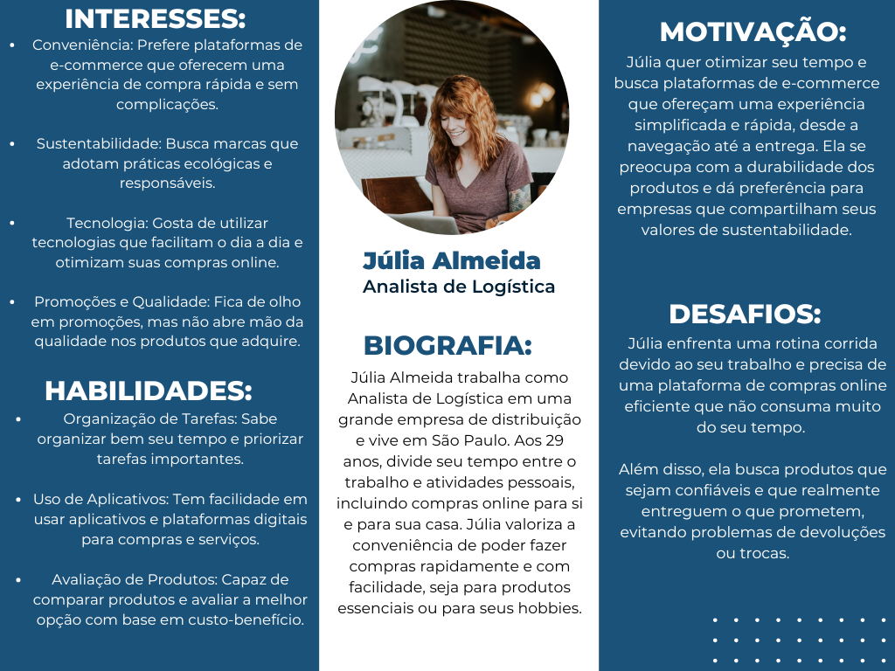

# Entendimento da Experiência do Usuário

## Introdução

&emsp;&emsp;Durante a fase inicial do desenvolvimento do projeto, foi realizada uma pesquisa com o objetivo de validar hipóteses relacionadas ao sistema de inventário vigente na VIVO, com foco nos problemas de sincronização entre a plataforma e o estoque. Paralelamente, buscou-se uma compreensão aprofundada do perfil do usuário final da solução, de modo a garantir que o Produto Mínimo Viável (MVP) atendesse às suas necessidades, problemas e comportamentos identificados na análise dos resultados.

&emsp;&emsp;Ademais, antes de proceder para a pesquisa quali-quantitativa, foi realizada uma imersão preliminar por meio de um workshop com os responsáveis pelo projeto. Durante o evento, foi apresentado uma visão inicial sobre o funcionamento da solução, seguido de uma sessão de perguntas e respostas destinada a entender as limitações, as abordagens já empregadas e os requisitos essenciais para o desenvolvimento do projeto. Como também, ocorreu a análise de documentos técnicos, como o TAPI, garantindo que a solução fosse estruturada para atender plenamente às expectativas do cliente final.

&emsp;&emsp;Logo em seguida, a pesquisa quali-quantitativa foi feita por meio de um formulário online, utilizando uma plataforma digital para assegurar ampla participação e facilidade de acesso aos trabalhadores da Vivo responsáveis pela plataforma E-commerce. O questionário foi elaborado com o propósito de coletar dados que permitissem uma compreensão mais precisa do funcionamento do sistema atual da empresa, bem como de identificar o perfil desses colaboradores, os principais desafios que enfrentam e as melhorias que esperam.

&emsp;&emsp;Dessa forma, o formulário foi distribuído a um grupo diversificado de pessoas, permitindo uma coleta de dados representativa e abrangente. Tal abordagem facilita a análise de tendências, preferências e áreas que necessitam de aprimoramento, contribuindo para a melhoria da experiência de compra dos usuários na plataforma de E-commerce da Vivo.

## Imersão Preliminar 
&emsp;&emsp; Imersão, nesse contexto, se refere ao envolvimento aprofundado ou à concentração em um tema específico. Dessa forma, a imersão preliminar é usada como uma ferramenta de análise e reflexão, aplicando diferentes técnicas para facilitar a compreensão e manipulação do contexto. Isso é feito antes de realizar uma pesquisa mais prática, como uma pesquisa quali-quantitativa. O objetivo principal dessa imersão é identificar os stakeholders, entender suas necessidades, integrar-se ao contexto deles, explorar soluções já utilizadas em problemas semelhantes e avaliar se essas abordagens podem agregar valor à solução que está sendo desenvolvida. Além disso, a imersão engloba diversas estratégias para aproximar os responsáveis pela solução das pessoas que vão usá-la.

### Pesquisa Exploratória

**Objetivo:** compreender as necessidades e desafios relacionados à integração dos estoques de lojas e centros de distribuição, bem como a exibição precisa dos prazos de entrega dos produtos.

**Metodologia:**
- Workshop com Parceiros: Engajamentos estruturados com stakeholders como gerentes, desenvolvedores e representantes dos clientes para descobrir suas expectativas, preocupações e validação de uma pré-solução apresentada pelo grupo.

- Análise de Documentação: Estudo detalhado de documentos e relatórios relevantes para ganhar uma perspectiva clara do projeto, seus objetivos e requisitos críticos.

**Insight Obtidos**
- Necessidades dos usuários:
    - Facilidade de Uso: Os stakeholders destacaram a importância de uma interface de usuário que seja acolhedora e fácil de usar. Isso permitirá que os funcionários das lojas e centros de distribuição naveguem e gerenciem o sistema de inventário de maneira eficiente.
    - Eficiência e Precisão: A velocidade de resposta do sistema e a precisão na atualização dos níveis de estoque e prazos de entrega foram identificadas como prioridades. Os usuários esperam que o sistema ofereça informações em tempo real para que as expectativas dos clientes sejam atendidas de forma consistente.

- Desafios tecnológicos: 
    - Compatibilidade e Integração: Um dos principais desafios identificados é a compatibilidade com os sistemas existentes da empresa e a falta de confiabilidade dos dados disponíveis em estoque. A integração deve ser planejada de forma a evitar dados falsos e garantir que todas as plataformas se comuniquem de maneira eficaz.

- Metas de negócios:
    - Crescimento da Base de Clientes: Uma meta identificada durante as entrevistas foi o aumento da base de clientes. A disponibilidade de informações precisas sobre o estoque e os prazos de entrega pode melhorar a experiência do cliente e contribuir para esse crescimento
    - Redução de Custos Operacionais: A otimização dos recursos, eliminando ineficiências e reduzindo custos operacionais relacionados à gestão de estoque, foi identificada como uma prioridade.
    - Satisfação do Cliente: Alcançar níveis mais elevados de satisfação do cliente é uma meta acordada com os parceiros. O objetivo é fornecer informações confiáveis sobre a disponibilidade de produtos e prazos de entrega, melhorando a experiência do cliente e a confiança no sistema.

### Pesquisa Desk
**Objetivo:** neste contexto é entender o cenário competitivo no setor de telecomunicações e gestão de inventário, as tendências emergentes em tecnologias de sincronização de estoque e otimização logística, além de outros fatores externos que podem afetar o projeto de Sistema de Inventário Distribuído da Vivo.

**Metodologia**: 
- Livros e Periódicos:
"Harvard Business Review" e "Journal of Supply Chain Management", focados em teorias e práticas sobre gestão de estoque e sincronização em tempo real.
- Publicações Oficiais: o Instituto Brasileiro de Geografia e Estatística (IBGE) e a Associação Brasileira de Telecomunicações (ABTelecom), que oferecem insights sobre o mercado de telecomunicações e logística no Brasil.
- Sites Especializados: TechRadar e Logistics Management, para acompanhar as tendências mais recentes em tecnologia de inventário e sistemas de logística.

**Dados Coletados**: 
- Mercado: 
    - Crescimento do setor de telecomunicações no Brasil apresentando uma expansão anual de cerca de 8%, com um aumento significativo na demanda por soluções de logística eficiente e em tempo real.
    - Há uma demanda crescente por sistemas de gestão de estoque que possam suportar a alta variação de produtos e serviços oferecidos pela Vivo.

- Tecnologia:
    - As melhores práticas incluem o uso de tecnologias como blockchain para rastreamento de inventário e inteligência artificial para previsão de demanda e otimização de estoque.
    - Avaliação das tecnologias de infraestrutura como serviço (IaaS) e plataformas em nuvem que garantem a alta disponibilidade e escalabilidade necessárias para suportar grandes volumes de transações.

### Conclusão
&emsp;&emsp;A imersão preliminar, permitiu uma análise abrangente do ambiente onde o projeto será desenvolvido. Os insights sobre tecnologias de inventário, práticas de escalabilidade, regulamentações e o cenário competitivo são cruciais para o sucesso do projeto. As informações coletadas orientarão o design e o desenvolvimento do sistema, garantindo que ele atenda às necessidades específicas da Vivo e ofereça uma solução confiável e eficiente.  Além disso, a capacidade de adaptação às mudanças no ambiente externo será essencial para o sucesso do projeto, e a colaboração contínua com os stakeholders e a integração de feedback serão fundamentais para atingir os objetivos do projeto. Esses dados são vitais para assegurar que o projeto seja bem-sucedido, beneficiando tanto a Vivo quanto os usuários finais.

## Pesquisa quali-quantitativa

&emsp;A pesquisa quali-quantitativa foi conduzida através de um formulário online, onde diversos funcionários responsáveis pela operação da plataforma e-commerce poderiam compartilhar seus pontos de vista para entendermos melhor suas percepções, necessidades e sentimentos em relação ao projeto.

&emsp;Através de perguntas objetivas e quantificáveis, a pesquisa buscou capturar insights que não foram totalmente explorados nas etapas anteriores. Vale notar que os dados coletados não representam toda a gama de funcionários, mas sim uma amostra que ajuda a definir o público-alvo para o projeto.

&emsp;Entretanto, o formulário obteve no total 2 respostas, com isso vieses podem acontecer devido ter pouca quantidade de candidatos para expressarem suas opiniões. 

&emsp;Sendo assim, a primeira pergunta do formulário abordou a faixa etária dos trabalhadores, garantindo que diferentes idades fossem consideradas e evitando o viés de focar em apenas um grupo etário. Os resultados mostraram que a idade média dos respondentes está entre 26 e 45 anos,  validando a hipótese de que esses participantes, por estarem mais familiarizados com tecnologia, enfrentariam menos dificuldades, como atrasos ou erros no sistema.

&emsp;Ademais, as outras perguntas foram voltadas para avaliar a eficiência do sistema de inventário atual, identificar os desafios enfrentados pelos usuários, e compreender quais melhorias e funcionalidades são consideradas essenciais.  

### Resultados das Perguntas:

- **Como você avalia a eficiência do sistema de inventário atual na sincronização de estoques?**

&emsp;Ambos os respondentes avaliaram o sistema com nota 3, concordando com a hipótese desenvolvida pela equipe de que, embora o sistema funcione, ele ainda apresenta ineficiências na sincronização de estoques, resultando em atrasos e imprecisões.

- **Quais desafios você enfrenta com o sistema de inventário atual?**

&emsp;Ambos mencionaram a lentidão na atualização dos dados, causada por operações assíncronas que ocorrem a cada 30 minutos, prejudicando a jornada de compra do cliente.

- **Com que frequência ocorrem problemas de estoque que afetam a jornada do cliente na plataforma?**

&emsp;Os funcionários indicaram que esses problemas ocorrem com uma frequência moderada (nota 2 em uma escala de 1 a 5), sugerindo que, embora não sejam constantes, há espaço para melhorias.

- **Quais funcionalidades você considera essenciais para um sistema de inventário distribuído eficiente?**
  
&emsp;Eles consideram a atualização em tempo real do sistema de inventário, a visibilidade centralizada de múltiplos centros de distribuição e a integração com outras plataformas como funcionalidades necessárias para a eficiência do sistema.

- **Quais melhorias você sugeriria para o sistema de inventário atual?**

&emsp;A pesquisa aberta permitiu que os indivíduos destacassem as áreas prioritárias para melhorias, embora a validade desses dados seja limitada devido ao pequeno número de participantes, possivelmente com vieses decorrentes de um ciclo de amizade próximo. Contudo, obtivemos as seguintes respostas:

Figura 1 - Respostas da pergunta sobre melhorias do sistema

Fonte: Material produzido pelos autores (2024)

&emsp;Portanto, ao combinar os insights da imersão preliminar com os resultados da pesquisa quali-quantitativa, foi possível obter uma compreensão básica das demandas dos usuários em relação à solução a ser desenvolvida. Isso oferece uma base para entender o público-alvo e orienta o projeto para atender melhor às necessidades identificadas, ainda que os resultados devam ser interpretados com cautela devido ao número limitado de respostas.

## Personas

&emsp;&emsp;No desenvolvimento de soluções de e-commerce, é essencial ter uma compreensão profunda da experiência do usuário final. A criação das "Personas" nos permite alcançar esse objetivo, pois elas representam arquétipos que ajudam a identificar as necessidades, comportamentos, e frustrações de diferentes tipos de clientes. Sendo assim, uma Persona é uma construção fictícia baseada em dados reais que reflete o cliente ideal para um projeto específico. Elas são fundamentais para orientar as decisões de design e desenvolvimento do sistema, assegurando que a solução final atenda às expectativas do público-alvo.

&emsp;&emsp;No contexto deste projeto, que visa a criação de um Sistema de Inventário Distribuído, as personas ajudam a moldar as funcionalidades e a interface da plataforma, com o foco em oferecer uma experiência de compra fluida, confiável e eficiente para os usuários finais. A plataforma busca otimizar o tempo dos consumidores, garantindo que os produtos estejam sempre disponíveis, sincronizando o estoque em múltiplos centros de distribuição em tempo real e agilizando o processo de entrega.

&emsp;&emsp;Para garantir que a plataforma atenda às reais expectativas dos consumidores, criamos duas personas focadas em usuários de e-commerce B2C. Essas personas fornecem insights valiosos sobre como consumidores finais, com diferentes perfis, interagem com as plataformas de compra online. Elas nos permitem projetar uma solução que facilite a jornada de compras desses usuários, abordando seus principais desafios, como a falta de tempo, a busca por produtos sustentáveis e a necessidade de uma entrega rápida e confiável.

### Persona 1: Ana Costa

Figura 2 - Persona Ana Costa

Fonte: Material produzido pelos autores (2024)

#### **Perfil**
&emsp;&emsp;Ana Costa, 32 anos, vive em São Paulo e trabalha como Coordenadora Administrativa em uma empresa. Com uma rotina intensa dividida entre o trabalho e as responsabilidades familiares, Ana utiliza frequentemente plataformas de e-commerce para facilitar suas compras diárias.

#### **Background Profissional**
&emsp;&emsp;Ana atua como Coordenadora Administrativa, onde gerencia processos e rotinas operacionais. Com uma agenda lotada, ela busca constantemente otimizar seu tempo, tanto no trabalho quanto em casa, usando a tecnologia para tornar suas atividades mais eficientes.

#### **Dor**
&emsp;&emsp;Ana enfrenta desafios relacionados à falta de tempo e à necessidade de realizar compras de forma rápida e sem complicações, seja para produtos essenciais ou para suas atividades pessoais. Além disso, ela valoriza marcas que ofereçam produtos duráveis e ecológicos, com entregas rápidas e seguras.

#### **Desafio Profissional**
&emsp;&emsp;Na vida profissional, Ana lida com diversas demandas simultâneas. No seu tempo livre, ela procura soluções que minimizem o esforço na gestão das suas necessidades pessoais, especialmente em suas compras. Ana busca uma experiência online fluida, que reduza o tempo necessário para concluir suas compras.

#### **Metas e Objetivos**
&emsp;&emsp;Ana deseja integrar mais conveniência em sua vida, tanto no âmbito pessoal quanto no profissional. Ela espera que as plataformas de e-commerce ofereçam uma navegação simples, com um equilíbrio entre preço e qualidade, além de entregas rápidas que não interfiram em sua rotina ocupada.

#### **Motivação**
&emsp;&emsp;Ana é motivada pela busca por eficiência em suas atividades diárias, especialmente no que diz respeito ao uso de plataformas de e-commerce. Ela procura por serviços que facilitem sua jornada de compras, com produtos que atendam aos seus valores de sustentabilidade e confiabilidade.

### Persona 2: Júlia Almeida

Figura 3 - Persona Júlia Almeida

Fonte: Material produzido pelos autores (2024)

#### **Perfil**

&emsp;&emsp;Júlia Almeida, 29 anos, mora em São Paulo e é Analista de Logística em uma empresa de distribuição. Com um estilo de vida dinâmico e uma rotina bem preenchida, Júlia depende de plataformas de e-commerce para fazer compras eficientes e resolver suas necessidades de consumo sem perder tempo.

#### **Background Profissional**
&emsp;&emsp;Como analista de logística, Júlia é responsável por otimizar processos e garantir que tudo flua corretamente nas operações de distribuição de sua empresa. Essa experiência faz com que ela valorize a eficiência e a praticidade também em suas interações pessoais com plataformas de e-commerce, onde busca facilidade e rapidez em suas compras.

#### **Dor**
&emsp;&emsp;Júlia lida com a falta de tempo devido à sua carga de trabalho e compromissos pessoais. Ela precisa de plataformas que permitam realizar compras sem estresse e com confiança na qualidade dos produtos e na precisão das entregas.

#### **Desafio Profissional**
&emsp;&emsp;Em sua vida profissional, Júlia já está constantemente buscando maneiras de otimizar processos. Quando se trata de suas compras pessoais, ela não quer gastar tempo em processos complexos ou esperar longos períodos de entrega. Além disso, ela procura marcas e plataformas que sejam sustentáveis e práticas.

#### **Metas e Objetivos**
&emsp;&emsp;Júlia quer economizar tempo e dinheiro nas suas compras online, priorizando a confiabilidade dos produtos e uma experiência de compra fácil e sem complicações. Ela também se preocupa com a sustentabilidade dos produtos que compra e deseja encontrar plataformas que reflitam esses valores.

#### **Motivação**
&emsp;&emsp;A principal motivação de Júlia é reduzir a complexidade de suas compras diárias e garantir que suas transações online sejam rápidas e eficientes. Ela valoriza plataformas de e-commerce que combinem funcionalidade e conveniência, permitindo que ela se concentre mais em sua carreira e menos nas tarefas cotidianas.

## Conclusão

&emsp;&emsp;Ao considerar as duas personas desenvolvidas (Ana Costa e Júlia Almeida), o projeto do Sistema de Inventário Distribuído tem como objetivo facilitar e aprimorar a experiência do usuário em plataformas de e-commerce B2C. Ambas as personas representam consumidores finais ocupados que procuram conveniência, rapidez e confiabilidade em suas interações com plataformas online. A partir do entendimento detalhado de suas necessidades e expectativas, podemos projetar uma solução que sincronize os estoques em tempo real, forneça uma experiência de compra fluida e ofereça entregas eficientes e rápidas.

&emsp;&emsp;Além disso, a inclusão de atributos como sustentabilidade e qualidade nas personas ressalta a importância de garantir que o sistema de inventário ofereça produtos que estejam alinhados aos valores dos consumidores modernos, que prezam por práticas éticas e ecológicas. A partir desse entendimento aprofundado da experiência do usuário, o sistema de inventário  será capaz de atender as demandas imediatas dos consumidores, e promoverá um relacionamento de confiança e longo prazo com as marcas e plataformas de e-commerce.

