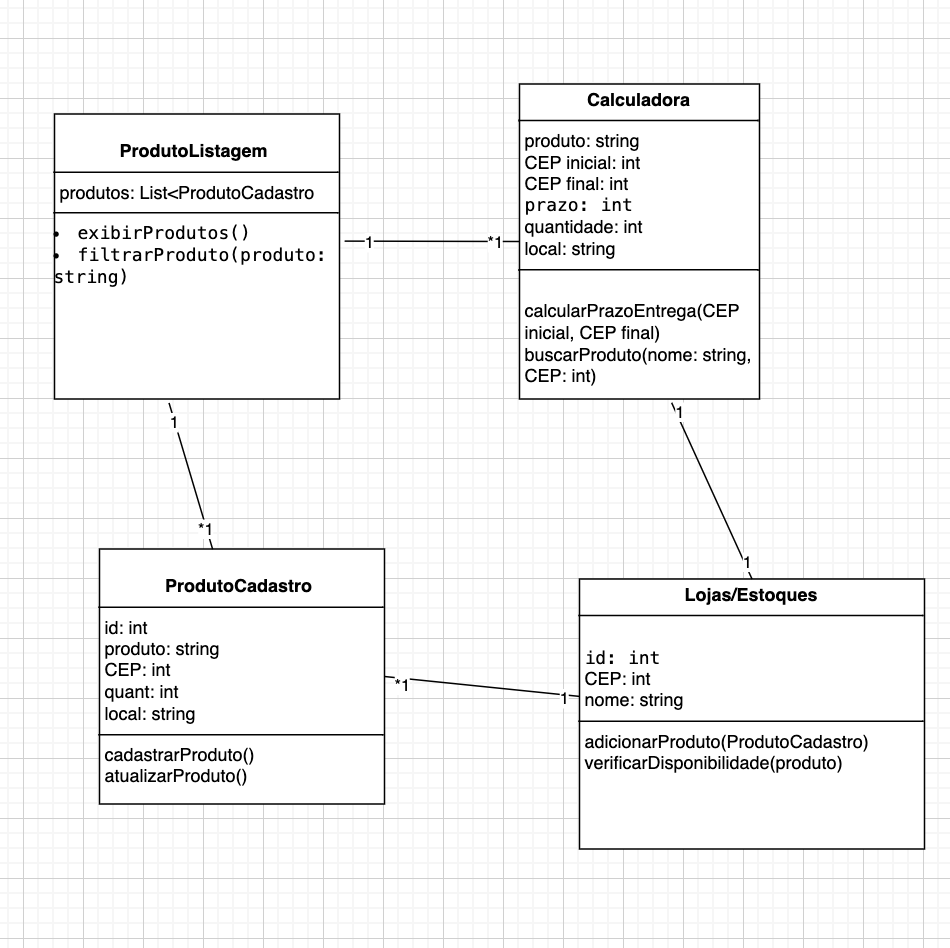
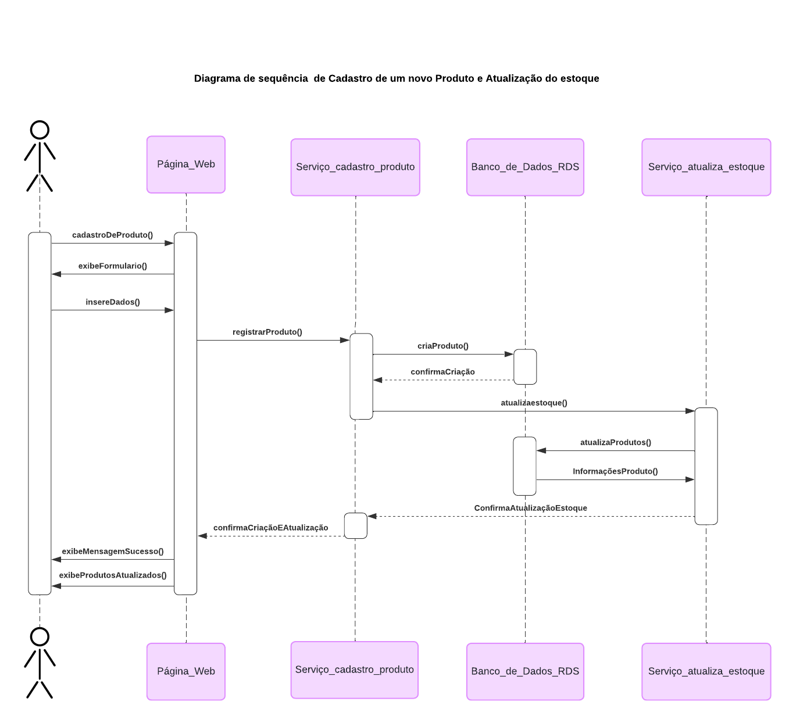
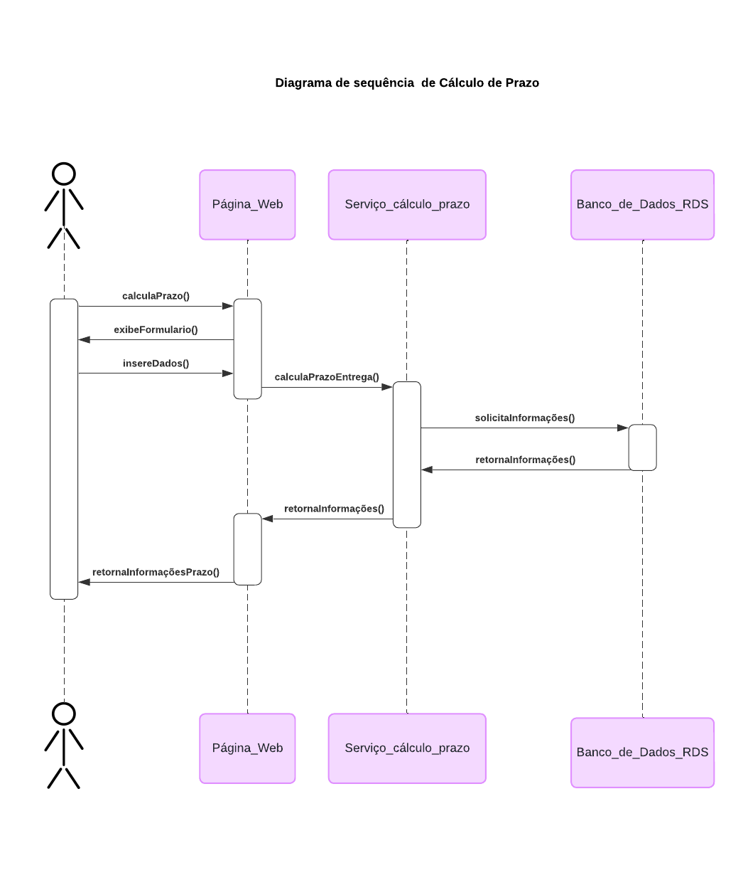

# Modelagem

## Diagrama e descrições dos Casos de Uso

## 1. Escopo do Sistema

### Sistema de Inventário Distribuído para Lojas e Centros de Distribuição
&emsp;O sistema tem como objetivo realizar a gestão de estoque em múltiplos centros de distribuição e lojas, assegurando a sincronização de dados em tempo real. A solução integra funcionalidades de consulta de disponibilidade, prazos de entrega e atualização de estoque.

## 2. Diagrama de Casos de Uso

&emsp;Antes de apresentar o diagrama de casos de uso, é importante contextualizar brevemente o propósito desse artefato dentro da modelagem de sistemas. O diagrama de casos de uso é uma ferramenta fundamental na UML (Unified Modeling Language) que nos permite visualizar as interações entre os atores externos (usuários ou sistemas) e as funcionalidades principais do sistema. Cada caso de uso descreve um cenário em que o ator interage com o sistema para alcançar um objetivo específico, ajudando a compreender os requisitos e as expectativas do sistema. 

&emsp;No projeto de inventário distribuído que estamos desenvolvendo para a Vivo, o diagrama de casos de uso mapeia todas as operações principais, como consultas de estoque, inserção de novas lojas e verificação de prazos de entrega, ilustrando claramente como os diferentes atores, como clientes, administradores e serviços de estoque, interagem com o sistema para garantir a sincronia e a precisão dos dados.

&emsp;Tendo em vista esses conceitos, é importante ressaltar alguns componentes fundamentais do diagrama de casos de uso que auxiliam na modelagem das interações do sistema. O ator é uma entidade externa ao sistema, podendo representar um usuário humano, um sistema externo ou outra entidade que interage com o sistema, como, por exemplo, o "Cliente" ou o "Administrador" no contexto do nosso projeto. Cada ator desempenha um papel específico, executando um ou mais casos de uso.

&emsp;Um caso de uso, por sua vez, representa uma funcionalidade ou serviço que o sistema oferece, como "Consultar Estoque" ou "Inserir Nova Loja". Esses casos de uso são representados por elipses, conectadas aos atores por meio de associações, que ilustram as interações diretas entre o ator e a funcionalidade correspondente.

&emsp;Por fim, temos a caixa de limite do sistema, que delimita o escopo do sistema. Tudo o que está dentro da caixa representa os componentes que fazem parte do sistema de inventário distribuído da Vivo, enquanto tudo fora dela está fora do escopo direto do sistema. Esse limite ajuda a visualizar as fronteiras entre o sistema e as entidades externas que o influenciam ou interagem com ele.

&emsp;A seguir, está o diagrama de casos de uso que reflete essas interações do projeto.

<b>Figura 1 </b>- Diagrama dos Casos de Uso 
 

Fonte: elaborado por GDE

## 3. Descrições dos Casos de Uso

### 3.1 **Caso de Uso: Consultar Estoque**
- **Escopo**: Sistema de Inventário Distribuído

- **Nível**: Usuário

- **Atores**: Cliente

- **Interessados e Interesses**:
  - **Cliente**: Deseja saber a disponibilidade de produtos antes de efetuar uma compra.
  - **Admin**: Garantir que as informações de estoque sejam precisas.
- **Pré-condições**: O cliente deve estar autenticado no sistema.
- **Pós-condições**: O cliente visualiza a disponibilidade do produto para seu CEP.
- **Fluxo Básico**:
  1. O cliente acessa o sistema e insere o CEP.

  2. O sistema consulta o estoque em múltiplos
   centros de distribuição.

  3. O sistema exibe a disponibilidade dos produtos.
- **Fluxos Alternativos**:
  - **F1**: Se o produto não estiver disponível em nenhum centro de distribuição, o sistema exibirá uma mensagem informando a indisponibilidade.
- **Requisitos Especiais**: Tempo de resposta rápido para consultas.
- **Lista de Variantes**: Pode incluir promoções em regiões específicas.
- **Frequência de Ocorrência**: Diária, com alta frequência de consultas.
- **Problemas em Aberto**: O sistema deve lidar com diferentes zonas de entrega e otimizar prazos.

### 3.2 **Caso de Uso: Consultar CEP de Entrega**
- **Escopo**: Sistema de Inventário Distribuído

- **Nível**: Usuário

- **Atores**: Cliente

- **Interessados e Interesses**:
  - **Cliente**: Deseja saber se o produto pode ser entregue em sua região.
  - **Admin**: Garantir que as regiões de entrega estejam atualizadas.
- **Pré-condições**: O cliente deve fornecer um CEP válido.
- **Pós-condições**: O cliente visualiza as opções de entrega disponíveis.
- **Fluxo Básico**:
  1. O cliente insere o CEP no sistema.
  2. O sistema valida o CEP e verifica as opções de entrega.
  3. O sistema exibe as opções de entrega.
- **Fluxos Alternativos**:
  - **F1**: Se o CEP não for válido, o sistema solicitará um novo CEP ao cliente.
- **Requisitos Especiais**: Verificação de CEP em tempo real.
- **Lista de Variantes**: Nenhuma.
- **Frequência de Ocorrência**: Diária.
- **Problemas em Aberto**: Gerenciamento de CEPs internacionais.

### 3.3 **Caso de Uso: Inserir Nova Loja**
- **Escopo**: Sistema de Inventário Distribuído

- **Nível**: Sistema

- **Atores**: Admin

- **Interessados e Interesses**:
  - **Admin**: Inserir novas lojas no sistema para expansão das operações.
  - **Clientes**: Acesso a novos locais de estoque e entrega.

- **Pré-condições**: O Admin deve estar autenticado no sistema.

- **Pós-condições**: A loja é inserida no banco de dados e aparece no sistema de consulta.

- **Fluxo Básico**:
  1. O Admin acessa a funcionalidade de inserção de novas lojas.
  2. O Admin preenche os dados da nova loja, como localização e capacidade de estoque.
  3. O sistema confirma a inserção e atualiza o banco de dados.

- **Fluxos Alternativos**:
  - **F1**: Se o Admin inserir dados inválidos, o sistema rejeitará a operação.

- **Requisitos Especiais**: Segurança para evitar inserções não autorizadas.

- **Lista de Variantes**: Lojas de diferentes regiões ou com diferentes capacidades.

- **Frequência de Ocorrência**: Ocasionalmente, quando novas lojas são adicionadas.

- **Problemas em Aberto**: Precisão dos dados de localização e estoque.

### 3.4 **Caso de Uso: Atualizar Estoque**
- **Escopo**: Sistema de Inventário Distribuído

- **Nível**: Sistema

- **Atores**: Admin, API Gateway

- **Interessados e Interesses**:
  - **Admin**: Manter o estoque atualizado para evitar falhas no processamento de pedidos.

  - **API Gateway**: Garantir que as atualizações sejam propagadas corretamente para todas as áreas do sistema.

- **Pré-condições**: O Admin deve estar autenticado no sistema.
- **Pós-condições**: O estoque atualizado é refletido no sistema para consultas.
- **Fluxo Básico**:
  1. O Admin acessa a funcionalidade de atualização de estoque.

  2. O Admin insere os novos dados de estoque (quantidade, localização).

  3. O sistema valida e atualiza o banco de dados.
- **Fluxos Alternativos**:
  - **F1**: Se os dados inseridos forem inválidos, o sistema notificará o Admin.
- **Requisitos Especiais**: Atualização rápida e confiável do banco de dados.

- **Lista de Variantes**: Estoque por tipo de produto ou região.

- **Frequência de Ocorrência**: Frequente, conforme necessário.

- **Problemas em Aberto**: Sincronização com múltiplos centros de distribuição.

### 3.5 **Caso de Uso: Verificar Prazos de Entrega**
- **Escopo**: Sistema de Inventário Distribuído

- **Nível**: Sistema

- **Atores**: API Gateway, Serviços de Estoque (CD1/CD2)
- **Interessados e Interesses**:
  - **Cliente**: Quer saber o prazo estimado de entrega antes de finalizar a compra.
  - **Admin**: Quer garantir que os prazos sejam precisos e atualizados.
- **Pré-condições**: O sistema deve ter acesso aos dados de CEP e estoque.
- **Pós-condições**: O sistema exibe ao cliente o prazo estimado de entrega.
- **Fluxo Básico**:
  1. O API Gateway solicita os prazos de entrega ao serviço de estoque.

  2. Os Serviços de Estoque consultam os centros de distribuição.

  3. O sistema exibe o prazo estimado ao cliente.
- **Fluxos Alternativos**:
  - **F1**: Se os dados de estoque forem insuficientes, o sistema oferece prazos alternativos.
- **Requisitos Especiais**: Consulta em tempo real e cálculo automático dos prazos.
- **Lista de Variantes**: Diferentes prazos para diferentes regiões.
- **Frequência de Ocorrência**: Frequente, durante o processo de compra.
- **Problemas em Aberto**: Otimização de rotas para entrega.

## 4. Conclusão
&emsp;Este documento detalha o escopo e as interações principais entre os usuários e o Sistema de Inventário Distribuído, cobrindo todos os casos de uso necessários para garantir o funcionamento adequado da plataforma e seu alinhamento com os requisitos do projeto. Cada caso de uso está devidamente descrito para assegurar o entendimento e a implementação eficaz.

## Diagrama de classes UML

&emsp;Diagramas de classe são representações visuais utilizadas na modelagem de sistemas orientados a objetos para descrever a estrutura estática de um sistema, ou seja, como as classes, objetos e seus relacionamentos estão organizados. Os principais componentes dele são:

- Classes: As classes são elementos centrais nos diagramas de classe. Elas representam os modelos abstratos dos objetos que podem ser criados no sistema. Cada classe descreve atributos (dados) e métodos (comportamentos) que os objetos dessa classe possuem.

- Atributos: Os atributos são características ou propriedades das classes, representando os dados que os objetos dessa classe contêm. Eles são listados dentro da classe e geralmente incluem tipos de dados e visibilidade (público, privado, protegido).

- Métodos: Os métodos são as funções ou operações que uma classe pode executar. Eles definem o comportamento dos objetos da classe e são declarados dentro da classe com suas assinaturas (nome, parâmetros e tipo de retorno).

- Relacionamentos: Os diagramas de classe mostram os relacionamentos entre as classes. Os tipos comuns de relacionamentos incluem associações (conexões entre classes), herança (uma classe herda características de outra) e composição/agregação (uma classe contém ou é parte de outra classe).

- Multiplicidade: A multiplicidade indica quantos objetos de uma classe estão relacionados a outra classe em uma associação. Por exemplo, "1" indica um relacionamento de um para um, enquanto "*1" indica que pode haver uma ou mais objetos relacionados.

Figura 2 - Diagrama de Classes 

Fonte: Material produzido pelos autores (2024)

### Classe 1: ProdutoCadastro
**Descrição:** A classe ProdutoCadastro gerencia o cadastro e atualização de produtos no sistema. Cada produto contém informações essenciais como nome, CEP, quantidade, e local de armazenamento (loja ou estoque).

**Atributos:**
- id: int — Identificador único para cada produto.
- produto: string — Nome do produto.
- CEP: int — CEP da loja ou estoque onde o produto está armazenado.
- quantidade: int — Quantidade disponível do produto.
- local: string — O local físico ou a loja/estoque onde o produto está armazenado.

**Métodos:**
- cadastrarProduto() — Método responsável por cadastrar um novo produto no sistema.

- atualizarProduto() — Método para atualizar as informações de um produto já cadastrado.

**Relacionamentos:**
- Associação com "ProdutoListagem":
    -  Multiplicidade: Um produto cadastrado pode ser exibido em uma listagem de produtos.
    - Multiplicidade: 1..* (ProdutoCadastro) -> 1 (ProdutoListagem).

- Associação com "Lojas/Estoques": Um produto deve estar associado a uma loja ou estoque, que determina de onde ele será retirado.
    - Multiplicidade: 1..* (ProdutoCadastro) -> 1 (Lojas/Estoques).

### Classe 2: ProdutoListagem
**Descrição:** A classe ProdutoListagem é responsável por armazenar e exibir todos os produtos cadastrados. Ela mantém uma lista de produtos, que são exibidos na interface como uma tabela de produtos com suas respectivas informações.

**Atributos:**
- produtos: List< ProdutoCadastro> — Uma lista que armazena todos os produtos cadastrados.
Métodos:
- exibirProdutos() — Método que exibe a lista de produtos na interface, como uma tabela de produtos cadastrados.
- filtrarProduto(produto: string) — Método para filtrar produtos na lista com base no nome.

**Relacionamentos:**

- Associação com "ProdutoCadastro":
    - Multiplicidade: 1 (ProdutoListagem) -> 1..* (ProdutoCadastro), pois a listagem pode exibir vários produtos cadastrados.

### Classe 3: Calculadora
**Descrição:** A classe Calculadora é responsável por realizar cálculos de prazo de entrega e buscar informações de produtos cadastrados com base em seus nomes e CEPs. Ela é usada para realizar consultas e cálculos relacionados à entrega dos produtos.

**Atributos:**
- produto: string — O nome do produto a ser buscado.
- CEP inicial: int — O CEP de origem do produto (da loja ou estoque).
- CEP final: int — O CEP de destino para calcular o prazo de entrega.
- prazo: int — O prazo de entrega em dias.
- quantidade: int — A quantidade disponível do produto.
- local: string — O local onde o produto está armazenado (loja/estoque).

**Métodos:**
- calcularPrazoEntrega(CEP inicial, CEP final) — Calcula o prazo de entrega do produto com base no CEP de origem e destino.
- buscarProduto(nome: string, CEP: int) — Busca o produto na listagem com base no nome e CEP.

**Relacionamentos:**

- Associação com "ProdutoListagem":A Calculadora acessa a listagem de produtos para buscar informações de produtos específicos.
    - Multiplicidade: 1..* (Calculadora) -> 1 (ProdutoListagem), pois a calculadora pode acessar a lista de vários produtos.

### Classe 4: Lojas/Estoques
**Descrição:** A classe Lojas/Estoques gerencia as informações das lojas ou estoques onde os produtos estão armazenados. Ela mantém dados sobre o local (CEP) e o nome da loja.

**Atributos:**
- id: int — Identificador único para a loja ou estoque.
- CEP: int — O CEP da loja ou estoque.
- nome: string — O nome da loja ou estoque.

**Métodos:**
- adicionarProduto(ProdutoCadastro) — Método para adicionar um produto ao estoque da loja.
- verificarDisponibilidade(produto) — Método que verifica a disponibilidade de um produto específico no estoque.

**Relacionamentos:**
- Associação com "ProdutoCadastro": Um estoque pode conter vários produtos cadastrados, e um produto sempre pertence a um estoque.
    - Multiplicidade: 1 (Lojas/Estoques) -> 1..* (ProdutoCadastro).

## Diagrama de sequência UML

&emsp; O diagrama de sequência UML é utilizado para representar as interações entre objetos de um sistema ao longo do tempo. Ele ilustra as mensagens trocadas entre os clientes e objetos, assim como a sequência em que ocorrem. Dessa forma, desenvolvemos dois diagramas de sequência para o projeto, demonstrando as ações de cadastro de produtos, atualização de estoque e cálculo de prazos. 

### Diagrama de sequência de cadastro de um novo produto e atualização do estoque

Figura 3 - Diagrama de sequência de cadastro de produto e atualização de estoque

Fonte: Material produzido pelos autores (2024)

#### Explicação do diagrama

&emsp; O usuário selecionará a opção de cadastrar um novo produto na página web da aplicação, que exibirá um formulário para a inserção das informações necessárias, tais como produto, CEP, quantidade e loja. Depois de preenchido, a página web enviará uma solicitação ao back-end responsável pelo serviço de cadastro de produto, que fará uma requisição POST ao banco de dados para criar o novo produto. Após a criação, o banco de dados retornará uma mensagem para o serviço de cadastro, o qual fará uma solicitação ao back-end responsável pela atualização de estoque para atualizar as suas informações.

&emsp;O serviço de atualização de estoque realizará uma requisição GET ao banco de dados para obter as informações do novo produto cadastrado e atualizar o estoque. Logo em seguida, enviará uma confirmação de que o estoque foi atualizado para o serviço de cadastro, o qual encaminhará uma confirmação de criação do produto e atualização do estoque para a página web. Por fim, a página exibirá um pop-up com uma mensagem de sucesso ao usuário e apresentará a lista de estoque dos produtos atualizada.

### Diagrama de sequência de Cálculo de Prazo

Figura 4 - Diagrama de sequência de cálculo de prazo

Fonte: Material produzido pelos autores (2024)

#### Explicação do diagrama

&emsp;O usuário selecionará a opção de calcular o prazo de entrega na página web da aplicação, que exibirá um formulário para preenchimento das informações necessárias, como o produto e o CEP de entrega. Após o preenchimento, a página web enviará uma solicitação ao back-end responsável pelo serviço de cálculo de prazo, que fará uma requisição GET ao banco de dados para obter informações sobre o local mais próximo onde o produto está disponível e as datas estimadas para entrega.

&emsp;O banco de dados retornará as informações solicitadas ao serviço de cálculo de prazo, que então os apresentará ao usuário em forma de uma lista, ordenada do prazo mais rápido para o mais demorado, a fim de que o usuário escolha a opção mais viável para entregar o produto ao cliente Vivo.

&emsp;Portanto, o desenvolvimento dos diagramas de sequência UML garantirá que a aplicação ofereça uma experiência eficiente e intuitiva para o usuário, permitindo o cadastro de produtos, a atualização do estoque e o cálculo dos prazos de entrega.

## Diagrama de Implantação UML 

&emsp;&emsp;O diagrama de implantação é uma ferramenta fundamental dentro da UML (Unified Modeling Language) utilizada para modelar a disposição física de componentes de software em infraestrutura de hardware. Esse tipo de diagrama é amplamente usado para ilustrar como os diferentes módulos de um sistema, como servidores de aplicação, bancos de dados e APIs, estão distribuídos entre dispositivos físicos e ambientes em nuvem, como a AWS (Amazon Web Services). Conforme descrito por Booch et al. (2007), diagramas de implantação ajudam a capturar a topologia física de um sistema, permitindo que arquitetos de software visualizem como os componentes se comunicam e como estão distribuídos no ambiente.  

&emsp;&emsp;No contexto do projeto de inventário distribuído da Vivo, o diagrama de implantação criado ilustra como os componentes interagem no ambiente de nuvem da AWS. Ele descreve o fluxo de comunicação entre o cliente (interface de usuário), o front-end (hospedado em instâncias EC2), o back-end e o banco de dados relacional RDS MySQL. A visualização clara desses elementos permite a análise do tráfego de dados, comunicação entre componentes e planejamento de escalabilidade e segurança. De acordo com os princípios de arquitetura distribuída descritos por Fowler (2010), diagramas desse tipo também são cruciais para identificar possíveis gargalos e otimizar a alocação de recursos em um ambiente dinâmico e altamente escalável  .

<b>Figura 5 </b>- Diagrama de Implantação
 

Fonte: elaborado por GDE

### Descrição Textual do Diagrama de Implantação

&emsp;Este diagrama de implantação modela a disposição física dos componentes principais do sistema e como eles interagem. Os principais elementos da arquitetura são descritos abaixo:

&emsp;&emsp;**Cliente**: Representa o usuário final que interage com o sistema através de uma interface web. O cliente faz **requisições HTTP** ao sistema para consultar informações de estoque e prazos de entrega.
  
&emsp;&emsp;**Servidor AWS**: O ambiente de hospedagem na **AWS** é onde todo o sistema está implementado. Ele contém os seguintes componentes:
  
&emsp;&emsp;**EC2 Front-end**: Uma instância do EC2 que serve o conteúdo HTML, CSS e JavaScript da interface web para o cliente. O front-end recebe as requisições do cliente e faz chamadas de API ao back-end.
      
&emsp;&emsp;**API Gateway**: Responsável por gerenciar as requisições recebidas do front-end e distribuí-las corretamente para os serviços de back-end. Ele serve como intermediário entre o front-end e o back-end, garantindo que as requisições sejam encaminhadas de maneira apropriada.
      
&emsp;&emsp;**EC2 Back-end**: Esta instância EC2 executa o servidor Node.js, que contém a lógica da aplicação. Ele recebe as requisições da API Gateway, processa as consultas de estoque e prazos de entrega, e interage com o banco de dados para retornar as informações corretas ao cliente.
      
&emsp;&emsp;**RDS MySQL**: O banco de dados relacional MySQL gerenciado pela AWS RDS, onde os dados de estoque, lojas, e CEPs estão armazenados. O back-end se comunica com o RDS para realizar consultas e atualizações de dados.
  
&emsp;&emsp;**Serviços de Estoque (CD1/CD2)**: Representam os serviços de estoque distribuídos que verificam e retornam as informações de estoque dos diferentes centros de distribuição. O back-end faz comunicação via HTTP com esses serviços para obter dados de disponibilidade de produtos.

&emsp;&emsp;O fluxo de dados segue o caminho de requisições HTTP vindas do cliente para o front-end. Esse, por sua vez, faz uma chamada de API ao API Gateway, que distribui as requisições para o back-end ou para os serviços de estoque. O back-end se conecta ao RDS MySQL para buscar ou atualizar dados relevantes, garantindo que as informações retornadas ao cliente estejam sempre atualizadas.

## Referências:
 BOOCH, G., RUMBAUGH, J., & JACOBSON, I. Unified Modeling Language User Guide. Addison-Wesley, 2007.  Disponível em: https://openlibrary.org/books/OL369757M/The_unified_modeling_language_user_guide . Acesso em: 5 set. 2024
 
 LARMAN, C. *Utilizando UML e Padrões: Uma Introdução à Análise e ao Projeto Orientados a Objetos e ao Desenvolvimento Iterativo*. 3ª edição. São Paulo: Bookman, 2007. Disponível em: https://www.kufunda.net/publicdocs/Utilizando%20UML%20e%20padr%C3%B5es%20(Craig%20Larman).pdf . Acesso em 5 de setembro de 2024.

BOOCH, G.; RUMBAUGH, J.; JACOBSON, I. *The Unified Modeling Language User Guide*. 2ª edição. Addison-Wesley Professional, 2005.Disponível em: https://archive.org/details/unifiedmodelingl00booc&#8203;:contentReference[oaicite:0]{index=0} Acesso em 6 de setembro de 2024. 

 FOWLER, M. Patterns of Enterprise Application Architecture. Addison-Wesley, 2010. Disponível em: https://archive.org/details/unifiedmodelingl00rumb Acesso em: 7 set. 2024

GAMMA, E. et al. Design Patterns: Elements of Reusable Object-Oriented Software. Addison-Wesley, 1994. Disponível em: https://www.oreilly.com/library/view/design-patterns-elements/0201633612/ Acesso em 8 de setembro de 2024.

