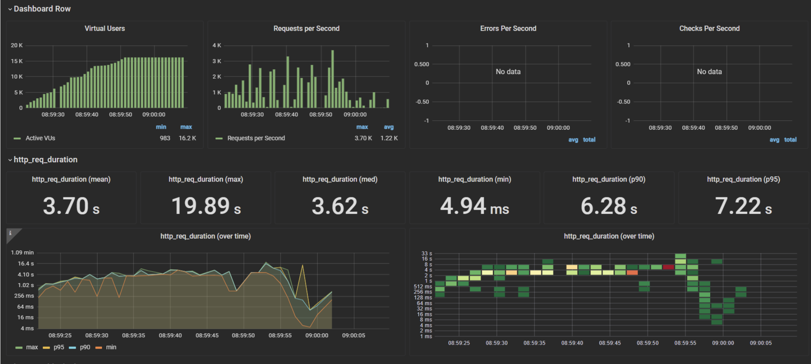

# Relatório Técnico
O objetivo dessa seção é apresentar e testar os requisitos não-funcionais que a aplicação deve seguir e analisar os resultados obtidos.

## Requisitos Não Funcionais 
Em nosso projeto, contemplamos 8 requisitos não funcionais, sendo eles:

- RNF1: Tempo de Resposta
- RNF2: Compatibilidade
- RNF3: Usabilidade
- RNF4: Confiabilidade
- RNF5: Segurança
- RNF6: Velocidade da aplicação em picos de tráfego
- RNF7: Elasticidade
- RNF8: Escalabilidade

Utilizando dos testes de carga, conseguimos verificar o **Tempo de resposta, velocidade da aplicação em picos de tráfego e elasticidade** do projeto 

# Requisitos não funcionais e testes
## Testes de Carga : RFN1, RFN6, RFN7, e RFN8
### Ferramentas utilizadas 

#### K6
Para a execução dos testes de carga, utilizamos o framework K6, desenvolvido pela GrafanaLabs.

Conforme descrito na documentação oficial, "o Grafana k6 é uma ferramenta de código aberto para testes de carga, projetada para simplificar e otimizar os testes de desempenho para equipes de engenharia. O k6 é gratuito, focado no desenvolvedor e altamente extensível."

Com o k6, é possível avaliar a confiabilidade e o desempenho dos sistemas, além de identificar regressões e problemas de performance de forma antecipada. Ele contribui para a criação de aplicações escaláveis e resilientes, com alto desempenho.

Por sua capacidade de adaptação a diferentes cenários, o K6 foi escolhido como a ferramenta ideal para testar a carga da nossa plataforma. Através de scripts em JavaScript, os usuários podem configurar e gerenciar testes que simulam diferentes níveis de carga em variados intervalos de tempo, permitindo uma análise detalhada da performance do sistema.


#### Grafana 
Também desenvolvido pela GrafanaLabs, o Grafana é a ferramenta que utilizamos para interpretar os dados gerados pelo K6.

De acordo com a documentação oficial do Grafana, "o software de código aberto Grafana permite consultar, visualizar, alertar e explorar métricas, logs e rastreamentos, independentemente de onde estejam armazenados."

Os resultados dos testes realizados com o K6 podem ser complexos e de difícil interpretação, especialmente para quem está começando. Por isso, o Grafana se torna uma ferramenta essencial, pois facilita a visualização dos dados gerados por meio de gráficos e dashboards intuitivos, permitindo uma análise mais clara e objetiva.

Em nosso caso específico, escolhemos um modelo de gráficos que requer o uso do InfluxDB, um banco de dados otimizado para séries temporais. Além de ser uma exigência do template escolhido, um dos grandes benefícios de optar pelo InfluxDB como fonte de dados para nosso painel no Grafana é o suporte nativo que o K6 oferece para exportar dados diretamente para ele, o que simplifica e agiliza a integração entre o K6 e o Grafana.


### Plano de Teste 
#### Teste 1: Tempo de Resposta e escalabilidade
Relacionado aos requisito não funcionais "RNF1: Tempo de resposta" e "RNF8: Escalabilidade", este teste deve simular uma carga típica, e a aplicação precisa assegurar que o carregamento da página ocorra em, no máximo, 2 segundos.

Baseado na pesquisa da **High Salability(2009)** ,o teste foi criado considerando que "carga normal" define-se como 600 requisições/segundo, e uma variação de 20% para representar a flutuação de usuários na plataforma.

Os seguintes parametros foram colocados:
```
export const options = {
  scenarios: {
    variable_request_rate: {
      executor: 'ramping-arrival-rate',
      startRate: 600,
      timeUnit: '1s',
      preAllocatedVUs: 100, 
      maxVUs: 1000,
      stages: [
        { duration: '10s', target: 660 }, 
        { duration: '10s', target: 540 }, 
        { duration: '10s', target: 600 }, 
	{ duration: '10s', target: 480 }, 
	{ duration: '10s', target: 720 }, 
        { duration: '10s', target: 600 }, 
      ],
    },
  },
};
````


#### Teste 2: Velocidade da aplicação em picos de tráfego e escalabilidade 
Relacionado aos requisitos não funcionais "RNF6: Velocidade da aplicação em picos de tráfego" e "RNF8: Escalabilidade" também, este teste deverá simular um cenário realista de carga, onde a aplicação precisa garantir que o tempo de carregamento da página seja, no máximo, de 2 segundos.

Já que a carga típica foi previamente definida no teste anterior, este teste será uma expansão desse cenário. Inicialmente, será simulada uma carga normal de 600 usuários por segundo, seguida de um aumento abrupto, com picos de até 35.000 requisições por segundo. Este incremento permitirá avaliar a robustez da aplicação sob condições de tráfego extremo, garantindo que o sistema possa manter a performance exigida mesmo em momentos críticos de alta demanda.

```
export const options = {
  scenarios: {
    variable_request_rate: {
      executor: 'ramping-arrival-rate',
      startRate: 600,
      timeUnit: '1s',
      preAllocatedVUs: 100, 
      maxVUs: 40000,
      stages: [
        { duration: '5s', target: 660 }, 
        { duration: '45s', target: 35000 }, 
        { duration: '10s', target: 600 }, 
      ],
    },
  },
};
```


#### Teste 3: Elasticidade e Escalabilidade 
Relacionado ao requisito não funcionail "RNF7: Elasticidade" e "RFN5: Segurança", este teste não tem um objetivo de requisições fixo, seu objetivo é testar e evidenciar as diferenças entre uma aplicação não elástica, e uma elástica, utilizando dos serviços disponíveis da AWS.

O funcionamento do teste é simples; a taxa de crescimento das requisições cresce linearmente de 0 até 35000 requisições por segundo.

````
export const options = {
  scenarios: {
    constant_request_rate: {
      executor: 'constant-arrival-rate',
      rate: 35000,
      timeUnit: '1s', 
      duration: '5s',
      preAllocatedVUs: 100,
      maxVUs: 35000,
    },
  },
};
````
### Resultados 

 K6 gera um relatório detalhado dos testes. Antes de examinarmos os resultados, é crucial compreender o significado de cada métrica apresentada.

- data_received : Quantidade total de dados recebidos dos  servidores alvo durante o teste.
- data_sent : Quantidade total de dados enviados aos servidores alvo durante o teste.
- dropped_iterations: Quantidade total de iterações que não puderam ser inicializadas.
- http_req_blocked : Tempo que as solicitações passaram bloqueadas antes de iniciar a conexão real.
- http_req_connecting : Tempo que as solicitações passaram conectando ao servidor.
- http_req_duration : Duração total de cada solicitação, desde o início até o recebimento da resposta.
- http_req_failed : Percentual e contagem de solicitações que falharam (não receberam uma resposta bem-sucedida).
- http_req_receiving : Tempo gasto recebendo a resposta do servidor.
- http_req_sending : Tempo gasto enviando a solicitação ao servidor.
- http_req_tls_handshaking : Tempo gasto no handshake TLS (para HTTPS).
- http_req_waiting : Tempo entre o final do envio da solicitação e o início do recebimento da resposta.
- http_reqs : Número total de solicitações feitas e a taxa de solicitações por segundo.
- iteration_duration : Duração total de cada iteração (cada execução da função default).
- iterations : Quantidade total de iterações concluídas e a taxa por segundo.
- vus : Número atual de Virtual Users (VUs) ativos durante o teste.
- vus_max : Número máximo permitido de VUs para este teste.


**Teste 1**

**Resultados K6** 
<div align="center">
<sub>Figura 1 - Teste 1</sub>

<sup>Fonte: Material produzido pelos autores (2024)</sup>
</div>

<div align="center">
<sub>Figura 2 - grafana</sub>

<sup>Fonte: Material produzido pelos autores (2024)</sup>
</div>


Os resultados deste teste de carga mostram o desempenho de um sistema testado usando o K6, com a visualização dos dados no Grafana. O teste foi realizado com um cenário que incluiu 1000 usuários virtuais simultâneos, distribuídos em seis estágios, com uma taxa de 720.00 iterações por segundo durante 1 minuto e 30 segundos de execução.

Na primeira parte do teste K6, o tempo médio de requisição HTTP (http_req_duration) foi de 4.86 ms, com um máximo de 136.58 ms e um mínimo de 1.75 ms. As medições p90 e p95 do tempo de requisição foram de 8.44 ms e 11.43 ms, respectivamente, indicando que 90% e 95% das requisições foram resolvidas dentro desses intervalos de tempo. O sistema processou 599.9376 iterações por segundo, com uma duração média de 3.31 ms por iteração.

Na visualização Grafana, os gráficos mostram que o sistema foi capaz de lidar com uma carga considerável de usuários virtuais e requisições por segundo sem erros relatados. As métricas destacam uma variação pequena entre os tempos de resposta mínimo e máximo, com estabilidade geral durante o teste. No entanto, a diferença entre os percentis p90 e p95 sugere que, sob carga elevada, uma pequena fração de requisições apresentou uma latência maior, o que pode ser um ponto a observar para otimização futura.


**Teste 2**
<div align="center">
<sub>Figura 3 - Teste 2</sub>

<sup>Fonte: Material produzido pelos autores (2024)</sup>
</div>

<div align="center">
<sub>Figura 4 - grafana </sub>

<sup>Fonte: Material produzido pelos autores (2024)</sup>
</div>

No segundo teste de carga realizado com K6, o sistema foi submetido a um cenário similar ao primeiro, com 1000 usuários virtuais simultâneos e uma duração de 1 minuto e 30 segundos. No entanto, os resultados mostram um aumento significativo nos tempos de requisição e resposta em comparação com o teste anterior.

A métrica média de duração da requisição HTTP (http_req_duration) foi de 984.71 ms, com um máximo de 9.44 s. O valor médio está bem acima do ideal para aplicações de alto desempenho, e o percentil 95 (p95) de 3.86 s indica que 95% das requisições foram concluídas dentro desse intervalo, enquanto o percentil 90 (p90) foi de 2.56 s. Isso reflete um aumento substancial na latência das respostas, sugerindo que o sistema começou a enfrentar limitações ao lidar com a carga imposta.

A visualização no Grafana mostra que o sistema conseguiu manter a quantidade de usuários virtuais e requisições por segundo, porém os tempos de resposta cresceram ao longo do teste, como mostrado na curva de aumento na métrica http_req_duration over time. Não houve erros por segundo ou falhas registradas, o que é um aspecto positivo, mas o tempo de resposta prolongado compromete a performance geral do sistema.


**Teste 3**
<div align="center">
<sub>Figura 5 - Teste 3</sub>

<sup>Fonte: Material produzido pelos autores (2024)</sup>
</div>

<div align="center">
<sub>Figura 6 - grafana</sub>

<sup>Fonte: Material produzido pelos autores (2024)</sup>
</div>
No terceiro teste de carga, o sistema foi submetido a uma pressão ainda maior, com 16.173 usuários virtuais simultâneos e uma taxa de 35.000 iterações por segundo. O resultado foi significativamente impactado, com várias requisições falhando devido a timeouts de I/O, conforme registrado pelos erros "Request Failed" no K6, indicando que o sistema não conseguiu lidar com o volume de requisições dentro do tempo esperado.

A métrica de duração das requisições HTTP (http_req_duration) teve uma média de 3.70 s, com um máximo de 19.89 s, mostrando tempos de resposta muito altos. O valor mediano foi de 3.62 s, enquanto os percentis 90 e 95 (p90 e p95) foram de 6.28 s e 7.22 s, respectivamente, evidenciando um desempenho que está longe do ideal. O tempo de resposta mínimo foi de apenas 4.94 ms, mas isso é um outlier frente ao restante dos dados.

Na visualização do Grafana, os gráficos mostram uma grande quantidade de usuários virtuais ativos e um número considerável de requisições por segundo, com um pico de mais de 3.700 requisições. A linha do tempo da duração das requisições (http_req_duration over time) revela uma crescente instabilidade à medida que o teste progride, com picos altos de latência nos momentos finais do teste. Notavelmente, não houve erros por segundo ou falhas explícitas relatadas no dashboard, exceto os timeouts já mencionados no K6.


## Testes RFN3 

**Objetivo** O objetivo é avaliar a usabilidade do sistema com base em dois cenários distintos: cálculo de prazo de entrega e cadastro de produtos. Os testes visam verificar se os usuários conseguem completar as tarefas com, no máximo, 3 cliques e se a interface é intuitiva e eficiente, acessível em múltiplos dispositivos.

Não conseguimos fazer os testes com os usuários finais da VIVO, porém os testes foram realizados com alunos do INTELI, visto que o intuito era apenas ver a usabilidade do projeto

### Teste 1: Cálculo de Prazo de Entrega
Descrição
Neste teste, o usuário precisa calcular o prazo de entrega de um produto. A interface possui um formulário simples onde o usuário preenche:

- Nome do produto.
- CEP final.
- Clica em um botão para exibir os resultados de produtos disponíveis e seus prazos de entrega.

### Plano de Teste
Instruções ao Usuário:
- Acesse a tela de cálculo de prazo de entrega.
- Preencha os campos "Nome do produto" e "CEP".
- Clique no botão “exibir resultados” para obter os resultados.

Critérios de Sucesso:
- O sistema deve exibir uma tabela com os prazos de entrega em até 10 segundos após o clique no botão.
- O usuário deve conseguir completar a tarefa com no máximo 3 cliques.

### Resultados
- Usuário 1: Completo com 3 cliques. Tempo de carregamento: 8,8 segundos.
- Usuário 2: Completo com 3 cliques. Tempo de carregamento: 6,5 segundos.
- Usuário 3: Completo com 3 cliques. Tempo de carregamento: 8 segundos.
- Usuário 4: Completo com 3 cliques. Tempo de carregamento: 9,7 segundos.
- Usuário 5: Completo com 3 cliques. Tempo de carregamento: 9,6 segundos.

Observações:
Todos os usuários conseguiram completar a tarefa com facilidade e dentro do limite de 3 cliques.
A interface foi considerada intuitiva, mas houve uma sugestão de adicionar uma mensagem de confirmação ao exibir os resultados.

### Teste 2: Cadastro de Produtos
Descrição
Neste teste, o usuário deve cadastrar um ou mais produtos no sistema. A interface contém um formulário com as seguintes seções:

- Nome do produto.
- Quantidade.
- CEP da loja.
- Loja (campo de seleção).
- Após preencher os campos, o usuário pode escolher entre "Adicionar mais produtos" ou "Finalizar cadastro" e visualizar a tabela de estoque.

### Plano de Teste
Instruções ao Usuário:

- Acesse a tela de cadastro de produtos.
- Preencha os campos do formulário.
- Escolha entre adicionar mais produtos ou finalizar o cadastro e exibir a lista de estoque.

Critérios de Sucesso:
- O usuário deve conseguir cadastrar pelo menos um produto com até 5 cliques por produto.
- A lista de estoque deve ser exibida imediatamente após o cadastro, sem demora perceptível.

### Resultados 
- Usuário 1: Cadastrou 2 produtos com 5 cliques por produto. A tabela de estoque carregou em 1,8 segundos.
- Usuário 2: Cadastrou 1 produto com 5 cliques. A tabela de estoque carregou em 2,1 segundos.
- Usuário 3: Cadastrou 3 produtos com 5 cliques por produto. A tabela de estoque carregou em 1,7 segundos.
- Usuário 4: Cadastrou 1 produto com 5 cliques. A tabela de estoque carregou em 1,9 segundos.
- Usuário 5: Cadastrou 2 produtos com 5 cliques por produto. A tabela de estoque carregou em 1,8 segundos.

Observações:

O processo de cadastro foi considerado eficiente, e todos os usuários conseguiram completar as tarefas com até 3 cliques por produto.

A possibilidade de adicionar múltiplos produtos foi vista como positiva, embora dois usuários sugeriram a melhoria na visualização da seção de cadastro quando vários produtos são incluídos.


### Conclusão
Ambos os testes mostraram que o sistema atende os requisitos de usabilidade, proporcionando uma boa e claraexperiência ao usuário. O tempo de carregamento foi dentro do esperado, com tempos menores que 2 segundos em ambos os testes. Ajustes pequenos na interface, como confirmação visual ao exibir resultados, poderiam melhorar ainda mais a experiência do usuário.


## Teste RFN2
**Objetivo:**
Verificar a compatibilidade do sistema com plataformas de e-commerce como Shopify e Magento, além de garantir a interoperabilidade com sistemas internos como o SAP ECC.

**Descrição:**
O sistema deve permitir integração sem falhas com diversas plataformas e garantir que os dados de produtos, pedidos e estoque sejam trocados corretamente entre o sistema da loja e essas plataformas externas.

**Impedimentos:**
Infelizmente, não foi possível realizar os testes de integração com as plataformas de e-commerce Shopify e Magento, nem com o sistema SAP ECC. Isso se deu pela indisponibilidade dos ambientes necessários para essas integrações no momento dos testes.

## Teste RFN4 
**Objetivo:**
O objetivo era validar a disponibilidade mínima de 99,9% do sistema ao longo de um período de 30 dias, garantindo que as informações de estoque estejam sempre sincronizadas e acessíveis. No entanto, devido a restrições financeiras e limitações do laboratório, foi possível realizar os testes por apenas algumas horas.

**Ferramentas Utilizadas:**
- AWS CloudWatch para monitoramento da disponibilidade e geração de métricas sobre o tempo de atividade dos serviços.
- Tabela de SLA da AWS para verificar a disponibilidade garantida por cada serviço utilizado.

**Critério de Sucesso:**
O sistema deve garantir uma disponibilidade mínima de 99,9%, o que permite uma indisponibilidade máxima de 43,8 minutos por mês (30 dias) ou 8 horas e 45 minutos por ano.


### Plano de Teste 
1. Definição do Escopo e Coleta de Dados:
    - Identificar todos os serviços essenciais da AWS usados pelo sistema (EC2, RDS, S3) e suas respectivas garantias de SLA.
    - O teste deveria monitorar o sistema por 30 dias, mas devido a restrições de uso de recursos, foi possível executar o teste apenas por algumas horas.

2. Configuração do Monitoramento:
    - Configurar métricas de uptime e downtime para os serviços críticos do sistema utilizando AWS CloudWatch.
    - Definir alertas para notificar qualquer falha ou downtime no sistema.

    
3. Cálculo da Disponibilidade:
 - A fórmula utilizada para calcular a disponibilidade foi:

$$Disponibilidade = \left( \frac{\text{Tempo disponível para uso}}{\text{Tempo total}} \right) \times 100$$ 


O tempo total deveria cobrir 43.200 minutos (30 dias), mas devido às limitações, monitoramos apenas por algumas horas.
Simulação de Indisponibilidade:

Durante o teste de algumas horas, simulamos interrupções de serviço e observamos a capacidade de recuperação do sistema.

**Limitações do Teste:**
Devido às limitações de orçamento no laboratório, que consumia créditos rapidamente, não foi possível executar o teste pelo período completo de 30 dias. O teste foi realizado por algumas horas, monitorando os principais serviços AWS. Embora insuficiente para validar a disponibilidade completa de 30 dias, os resultados indicam que a plataforma operaria conforme esperado em um ambiente real.

### Resultados
- **Serviço EC2 (AWS SLA: 99,95%):**
    - Tempo total monitorado: 3 horas (180 minutos).
    - Tempo de indisponibilidade: 0 minutos.
    - Disponibilidade calculada: 100%.

- **Serviço RDS (AWS SLA: 99,95%):**
    - Tempo total monitorado: 3 horas (180 minutos).
    - Tempo de indisponibilidade: 0 minutos.
    - Disponibilidade calculada: 100%.


### Conclusão:
Embora o teste tenha sido realizado apenas por algumas horas devido a restrições de consumo de créditos no laboratório, os resultados indicam que, em teoria, o sistema atenderia ao requisito de 99,9% de disponibilidade se fosse testado durante o período de 30 dias. No entanto, recomenda-se realizar testes em ambientes de produção ou laboratório com mais créditos disponíveis para validar a disponibilidade ao longo de um ciclo completo de 30 dias.


