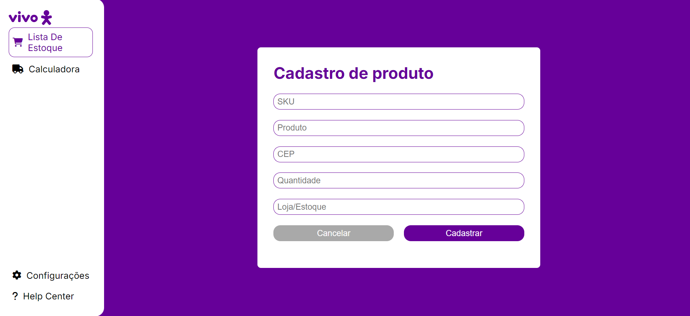
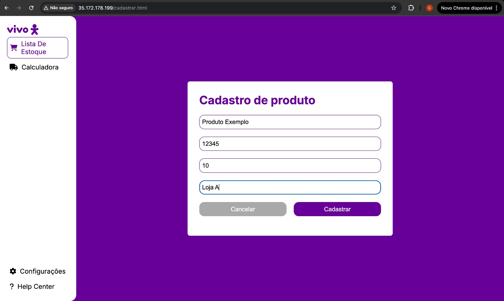
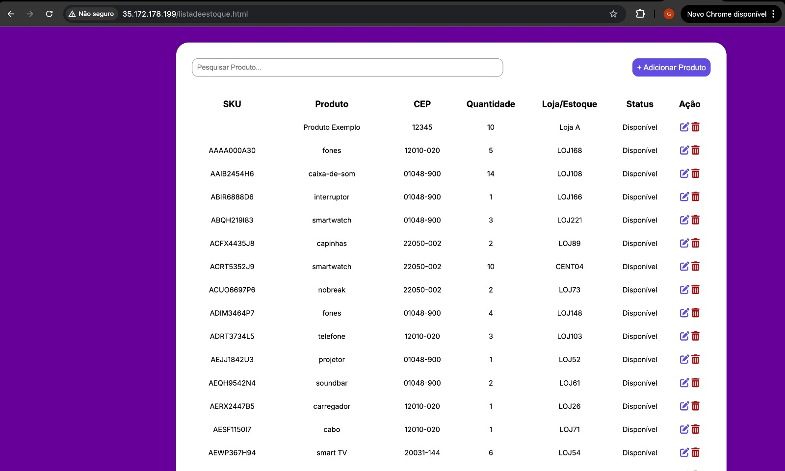
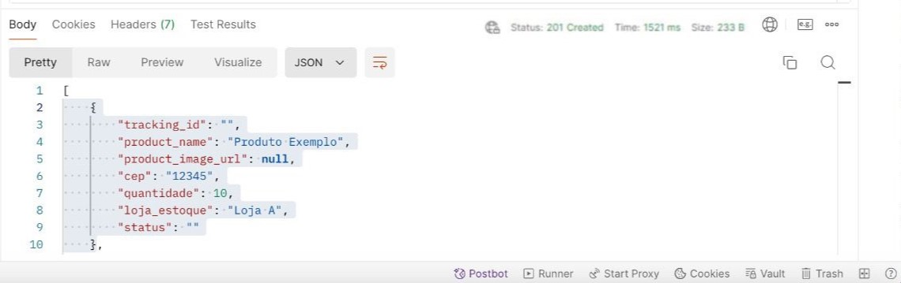
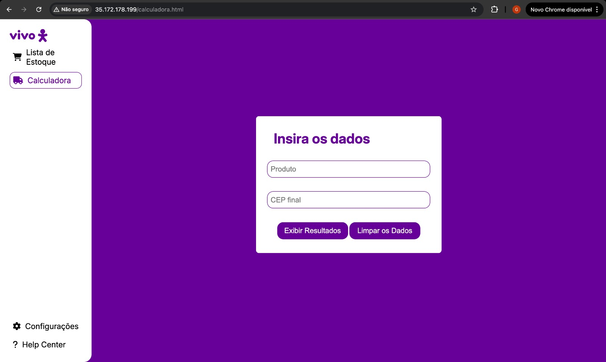
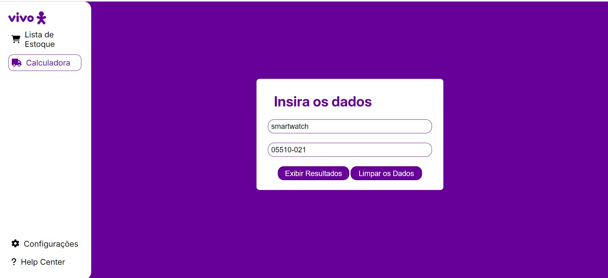
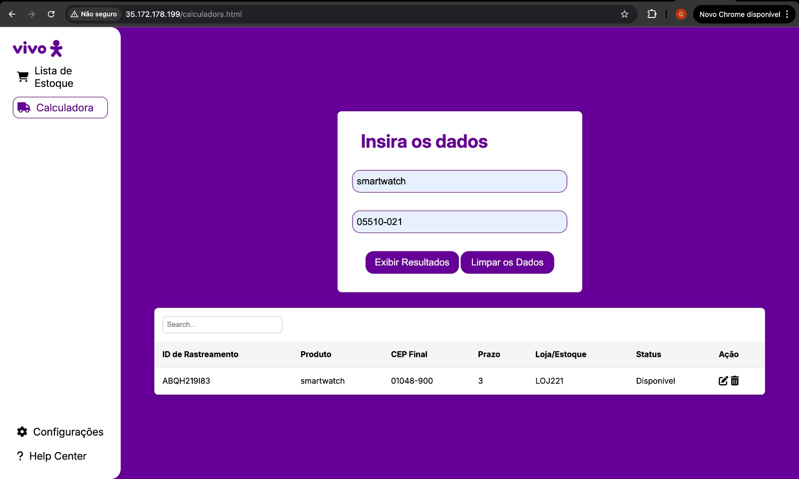
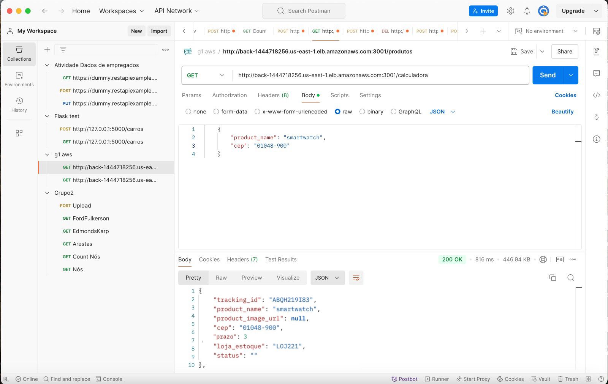
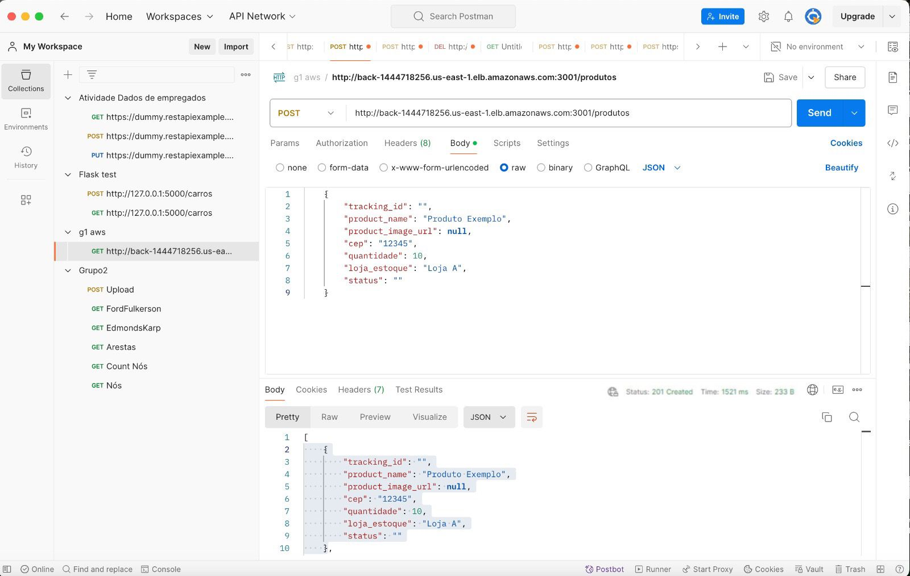
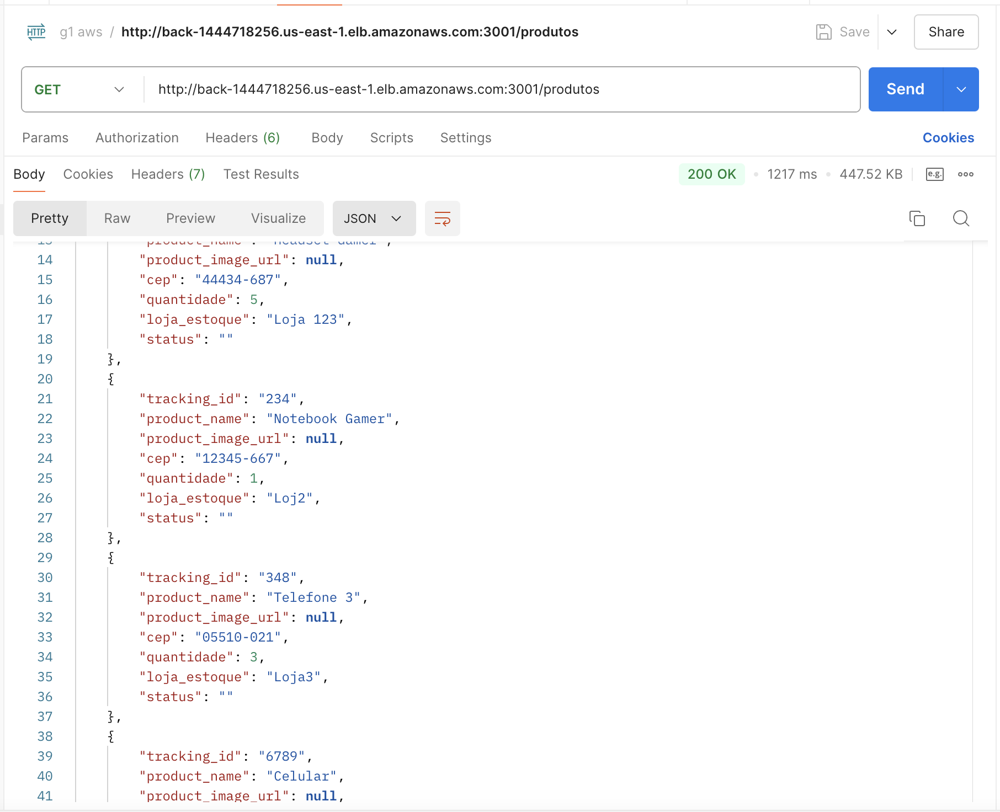

# Testes

# Cenário de testes
## Cenário 1: Consulta de Estoque (RF1)
**Descrição:** Verificar se o sistema permite a consulta de estoque, exibindo informações corretas e atualizadas sobre itens em diferentes centros de distribuição e lojas.

**Passos do Cenário:**
- O usuário acessa o sistema de gerenciamento de estoque.
- O usuário seleciona a opção de "Lista de Estoque" na side bar.
- O sistema exibe a lista de itens disponíveis com seus respectivos locais de armazenamento (centros de distribuição e lojas).

**Resultado Esperado:** O sistema exibe corretamente as informações de estoque atualizadas para cada local.

## Cenário 2: Atualização de Estoque (RF2)
**Descrição:** Verificar se o sistema permite a atualização correta do estoque, garantindo que as alterações sejam refletidas de forma sincronizada.

**Passos do Cenário:**
- O usuário acessa o sistema e escolhe a opção "Lista de Estoque".
- O usuário seleciona uma linha da tabela e clina no ícone de editar.
- o usuário edita e atualiza as informações necessárias.
- O sistema exibe uma mensagem de confirmação após a atualização dos dados.
- O usuário realiza uma consulta para verificar se os itens foram atualizados no estoque.

**Resultado Esperado:** O estoque é atualizado corretamente, e a consulta exibe a quantidade correta de itens.

## Cenário 3: Sincronização Automática de Dados de Estoque (RF3)
**Descrição:** Verificar se o sistema sincroniza automaticamente os dados de estoque entre centros de distribuição e lojas.

**Passos do Cenário:**
- O usuário atualiza o estoque em um centro de distribuição.
- O sistema inicia automaticamente a sincronização com as lojas conectadas.
- O usuário verifica o estoque nas lojas para confirmar a atualização.

**Resultado Esperado:** O sistema sincroniza corretamente as atualizações do estoque em tempo real em todas as lojas e centros de distribuição.

## Cenário 4: Integração com SAP ECC (RF4)
**Descrição:** Verificar a integração com o SAP ECC para importar e validar os dados de estoque.

**Passos do Cenário:**
- O sistema realiza a importação dos dados de estoque do SAP ECC.
- O usuário faz uma consulta para verificar os itens no estoque sincronizados com o SAP.
- O usuário simula uma compra e verifica se os dados de estoque são validados corretamente durante o processo.

**Resultado Esperado:** O sistema deve importar e validar corretamente os dados de estoque, refletindo as informações do SAP ECC durante o processo de compra.

## Cenário 5: Geração de Relatórios de Inventário (RF5)
**Descrição:** Verificar se o sistema gera relatórios detalhados de inventário.

**Passos do Cenário:**
- O usuário acessa a função "Gerar Relatórios".
- O sistema solicita parâmetros como data e local para a geração do relatório.
- O usuário insere os parâmetros e solicita o relatório.
- O sistema gera e exibe o relatório com as movimentações de estoque, status atual e previsão de reposição.

**Resultado Esperado:** O relatório deve ser gerado com todas as informações corretas e detalhadas, incluindo dados precisos sobre o estoque e previsões de reposição.

## Cenário de Teste 6: Interface de Gestão de Estoque (RF6)
**Descrição:** Verificar se a interface de usuário permite a gestão de estoque de forma eficiente.

**Passos do Cenário:**
- O usuário acessa a interface de gestão de estoque.
- O usuário realiza operações como consulta, atualização e monitoramento de estoque.
- O sistema deve fornecer feedback em tempo real e ser fácil de navegar.
- O feedback dos usuários é coletado para avaliar a facilidade de uso.

**Resultado Esperado:** A interface deve ser fácil de usar, intuitiva, e permitir o gerenciamento completo do estoque sem dificuldades.

## Cenário de Teste 7: Consulta de Disponibilidade de Produtos (RF7)
**Descrição:** Verificar se o sistema permite aos clientes consultar a disponibilidade de produtos por CEP.

**Passos do Cenário:**

O cliente acessa o sistema e insere o CEP durante a compra.
O sistema verifica a disponibilidade de produtos nos centros de distribuição e lojas próximas.
O cliente visualiza os produtos disponíveis para sua região.

Resultado Esperado: O sistema deve retornar corretamente a disponibilidade dos produtos com base no CEP informado.

## Cenário de Teste 8: Notificações de Baixa de Estoque (RF8)
**Descrição:** Verificar se o sistema envia notificações automáticas quando o estoque de um item atinge um nível crítico.

**Passos do Cenário:**
- O usuário acessa o sistema e realiza uma operação que reduz o nível de estoque de um item.
- O sistema verifica se o estoque atingiu o nível mínimo estabelecido.
- Se o nível crítico for atingido, o sistema envia uma notificação ao gestor.

**Resultado Esperado:** O sistema deve enviar notificações automáticas e em tempo real quando o nível de estoque de um item estiver baixo, permitindo que o gestor tome ações de reposição.

## Teste de Integração

&emsp; O teste de integração é uma etapa do processo de desenvolvimento de software em que módulos ou componentes são combinados e testados juntos, com o objetivo de identificar problemas que possam surgir quando diferentes partes do sistema interagem, garantindo que a comunicação entre módulos ocorra de forma fluida e que os dados sejam transferidos corretamente.

### Teste 1: Cadastro de um novo produto e visualização no estoque.

| Teste 1 |  |
| --- | --- |
| **Descrição** | Verificar se a aplicação permite cadastrar um novo produto corretamente e se ele aparece na lista de estoque após o cadastro.|
| **Passos para a execução** | 1. Acessar a página "Lista de estoque". 2. Clicar no botão roxo “+ Adicionar Produto” 3. Preencher o formulário com as informações do novo produto. 4. Clicar no botão “cadastrar”. 5. Retornar para a tela de listagem de estoque e visualizar o produto cadastrado.|
| **Resultado Esperado** | Retorno do produto cadastrado na lista de estoque e a mensagem 'Status Code: 201 Created' no backend. |
| **Resultado Obtido** |  Produto cadastrado com sucesso e retornado na lista de estoque.|

<div align="center">
<sub>Figura 1 - Página de cadastro de produto</sub>

<sup>Fonte: Material produzido pelos autores (2024)</sup>
</div>

<div align="center">
<sub>Figura 2 - Página de cadastro de produto preenchida</sub>

<sup>Fonte: Material produzido pelos autores (2024)</sup>
</div>

<div align="center">
<sub>Figura 3 - Retorno do produto na lista de estoque</sub>

<sup>Fonte: Material produzido pelos autores (2024)</sup>
</div>

<div align="center">
<sub>Figura 4 - Teste de cadastro de produto</sub>

<sup>Fonte: Material produzido pelos autores (2024)</sup>
</div>


### Teste 2: Cálculo do prazo de entrega de um produto e retorno do menor prazo.

| Teste 2 |  |
| --- | --- |
| **Descrição** | Verificar se o cálculo dos prazos de entrega estão feitos corretamente através da calculadora de prazos.|
| **Passos para a execução** | 1. Acessar a página de calcular prazo. 2. Preencher o formulário com as informações solicitadas (Produto e CEP Final). 3. Clicar no botão “Exibir Resultados”. 4. Analisar os resultados retornados.|
| **Resultado Esperado** | Retorno de uma lista com todas as lojas onde o produto está disponível, ordenada pelo menor prazo de entrega e um código '200 OK' no backend. |
| **Resultado Obtido** |  Uma lista com todos os prazos de entrega, onde o usuário poderá escolher qual o melhor prazo.|

<div align="center">
<sub>Figura 5 - Tela de calcular prazo</sub>

<sup>Fonte: Material produzido pelos autores (2024)</sup>
</div>

<div align="center">
<sub>Figura 6 - Preenchimento do formulário para calcular o prazo</sub>

<sup>Fonte: Material produzido pelos autores (2024)</sup>
</div>

<div align="center">
<sub>Figura 7 - Retorno da lista de prazos de entrega</sub>

<sup>Fonte: Material produzido pelos autores (2024)</sup>
</div>

<div align="center">
<sub>Figura 8 - Teste do cálculo de prazo de entrega</sub>

<sup>Fonte: Material produzido pelos autores (2024)</sup>
</div>

&emsp;Portanto, ao realizar os dois testes de integração, é possível concluir que as funcionalidades de cadastrar produtos e retornar na lista de estoque, como também, a de calcular o prazo de entrega, estão funcionando corretamente. Ambos os testes retornaram os resultados esperados, confirmando que a aplicação é capaz de gerenciar o estoque de forma eficiente e de calcular o prazo de entrega com precisão, garantindo uma boa experiência para os usuários.


# Teste de Microserviço 
O teste de microserviço é essencial para garantir que nosso serviço esteja funcionando conforme o esperado, assegurando que as operações de inserção, recuperação, atualização e exclusão de dados ocorram de forma correta e eficiente. Embora nosso projeto atual utilize uma única API e não uma arquitetura de microserviços completa, adotaremos uma abordagem abrangente para avaliar a API em todos os seus aspectos críticos. Os testes foram conduzidos no Postman, cobrindo dois principais tipos de requisições: GET e POST  a fim de verificar a funcionalidade e integridade das operações da API.

## T1 
### Planejamento do Teste
**Objetivo:**
O objetivo deste teste é verificar se a API de cadastro de produtos está funcionando corretamente, recebendo os dados do produto enviados via formulário e armazenando-os na base de dados.

**Descrição:**
O teste consiste em simular a submissão de um formulário de cadastro de produto, enviando uma requisição POST para a API com os dados do produto, como nome, CEP, quantidade e nome da loja. Após o envio da requisição, será verificado se o produto foi cadastrado corretamente na base de dados e se a resposta da API contém o feedback esperado.

**Cenário:**
1. O usuário envia uma requisição POST para o endpoint /products com as informações de um novo produto.
2. A API processa a requisição e insere o produto na base de dados.
3. A resposta da API deve retornar um código de status 201 indicando que o produto foi cadastrado com sucesso, junto com uma mensagem de confirmação.

**Passos para Realização do Teste no Postman** 
1. **Abrir o Postman:**

    - Acesse o Postman e crie uma nova requisição.

2. **Configurar a requisição:**
    - Método: POST
    - URL: http://ec2-34-229-180-95.compute-1.amazonaws.com:3000/cadastrar

    -  Corpo de requisição
        ````
        {
        "traking_id":""
        "name": "Produto exemplo",
        "product_image_url":null
        "cep": "12345-678",
        "quantidade": "10",
        "loja_estoqye": "Loja A"
        "status":""
        }
        ````
3. **Enviar a requisição:**
    - Clique em Send para enviar a requisição com os dados do produto.

4. **Verificar a resposta:**
    - A resposta da API deve ser analisada para validar se o produto foi adicionado corretamente. O esperado é:
    - Status Code: 201 Created

5. **Validação de Sucesso:**
    - Se o status da resposta for 201, o teste foi bem-sucedido e o produto foi cadastrado no banco de dados.
    - Caso contrário, se o status for 400 ou 500, ou se a resposta indicar erro, será necessário investigar a causa, como dados inválidos ou falha no servidor.

**Resultados**
    <div align="center">
    <sub>Figura 9 - Requisição POST</sub>
    
    <sup>Fonte: Material produzido pelos autores (2024)</sup>
    </div>
O teste obteve sucesso retornanto o status 201 e criando o produto exemplo 


## T2 
### Planejamento do Teste
**Objetivo:**
Verificar se o endpoint que retorna a lista de produtos está funcionando corretamente, recebendo a requisição e retornando os dados dos produtos armazenados no banco de dados.

**Descrição:**
Será feita uma requisição GET para o endpoint da API de produtos. O teste verificará se os produtos existentes no banco de dados são retornados corretamente com as informações necessárias, como nome, CEP, quantidade e nome da loja.

**Cenário:**
- O usuário faz uma requisição GET para o endpoint /products.
- A API processa a requisição e retorna uma lista de produtos cadastrados.
- A resposta da API deve retornar um código de status 200, junto com a lista de produtos em formato JSON.

**Passos para Realização do Teste no Postman**
1. **Abrir o Postman:**

2. **Acesse o Postman e crie uma nova requisição.**
Configurar a requisição:
    -  Método: GET
    - URL: http://back-1444718256.us-east-1.elb.amazonaws.com:3001/produtos
    - Não é necessário enviar corpo da requisição ou cabeçalhos específicos para esse teste.

3. **Enviar a requisição:**
    - Clique em Send para enviar a requisição GET e obter a lista de produtos.

4. **Verificar a resposta:**
    - A resposta da API deve ser analisada para validar se os produtos foram retornados corretamente. O esperado é:
    - Status Code: 200 OK

5. **Validação de Sucesso:**
    - Se o status da resposta for 200 e o corpo contiver a lista de produtos cadastrados com as informações corretas, o teste foi bem-sucedido.
    - Se o status for diferente de 200 ou se o corpo não contiver os dados esperados, será necessário investigar a causa (como problemas na conexão com o banco de dados ou ausência de produtos cadastrados).

**Resultados**
    <div align="center">
    <sub>Figura 10 - Requisição GET</sub>
    
    <sup>Fonte: Material produzido pelos autores (2024)</sup>
    </div>
O teste obteve sucesso com a respota 200 OK e a lista de produtos cadastrados. 

# Testes Unitários 
O teste unitário é um componente essencial no desenvolvimento de software, assegurando que cada parte do nosso sistema funcione corretamente de maneira isolada. Mesmo que nosso sistema seja composto apenas por uma API e não por múltiplos microserviços, a aplicação de testes unitários em cada classe e método nos permite identificar e corrigir erros de forma precoce, garantindo a qualidade e a confiabilidade do software.

Os testes ocorreram no arquivo server.test.js, feitos dentro da AWS do nosso projeto.

## Descrição dos Testes Unitários:
### Testar o upload de arquivo CSV:

**Objetivo:** Verificar se o servidor processa corretamente um arquivo CSV enviado e insere os dados no banco de dados.

**Cenário de Teste:**
- Cenário positivo: Um arquivo CSV válido é enviado e processado corretamente.
- Cenário negativo: Nenhum arquivo é enviado, e o servidor retorna um erro.

**Resultado**: o arquivo processado no final não foi csv e sim xlsx, e foi enviado e inserido com sucesso 

### Testar a listagem de produtos:
**Objetivo:** Verificar se o servidor retorna corretamente uma lista de todos os produtos.

**Cenário de Teste:**
- Cenário positivo: Produtos existentes são retornados em um array.
- Cenário negativo: Nenhum produto existe no banco de dados.

**Resultado**: Todos os produtos listados foram retornados com sucesso

### Testar a busca de produto pelo nome:

**Objetivo:** Verificar se o servidor retorna corretamente um produto quando consultado pelo nome.

**Cenário de Teste:**
- Cenário positivo: O produto é encontrado pelo nome e retornado corretamente.
- Cenário negativo: Nenhum produto é encontrado com o nome fornecido.

**Resultado**: Procuramos o produto "smartwatch"e ele foi encontrado corretamente 

### Testar a adição de um novo produto:

**Objetivo:** Verificar se o servidor insere corretamente um novo produto no banco de dados.

**Cenário de Teste:**
- Cenário positivo: Todos os dados do produto são fornecidos corretamente, e o produto é adicionado.
- Cenário negativo: Dados faltantes ou inválidos causam erro na inserção. 

**Resultado**: o Produto e suas informações foram listadas e inseridas corretamentes. 


Retorno do terminal após a rodada de teste. 
````
PASS  ./server.test.js
  Testes Unitários dos Endpoints
    ✓ deve processar o upload do CSV corretamente (300 ms)
    ✓ deve retornar erro se nenhum arquivo for enviado (50 ms)
    ✓ deve listar todos os produtos (100 ms)
    ✓ deve adicionar um novo produto (120 ms)

Test Suites: 1 passed, 1 total
Tests:       4 passed, 4 total
Snapshots:   0 total
Time:        0.550 s
Ran all test suites.
```  

